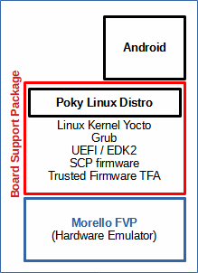

# Downloading and building Android on Morello FVP

 [Go back to Morello Getting Started Guide.](./../../../morello-getting-started.md)

*Android* can be installed to run on top of the Morello FVP.  This provides a runtime environment for testing shell-based applications. Firmware is also required to be built that runs on the Morello Platform, together with *Poky Linux*. These make up the *board support package.* The developer can interface to either Poky Linux or Android. Pre-built cross-compiled applications can be transferred to Android from the host environment (Ubuntu 18.04) using the Android debug bridge.



## Overview

This document covers
1. Downloading the source code
2. Builing the firmware
3. Building Android
4. Running Android on the Morello FVP
5. Running the Android debug bridge (ADB) to connect to the shell of the FVP
6. Setting up the build environment variables for an application to run on Android
7. Build the workload tests application
8. Running workload tests on the FVP using the Android bridge

This document largely follows the Android section (@4mins 13sec) into the video guide at the following link:

https://www.morello-project.org/resources/morello-platform-model-and-android-stack-walkthrough/ 

Where necessary, extra information has been added to aid with clarity of the step by step procedure.

## Assumptions:

You have already installed the Morello FVP. 

Installing and building Android may take several hours depending upon the specification of your machine.

If you have a problem with the installation refer to the section on *Discovered Issues and Work-arounds* below. 

## Downloading the source code

1. Install the list of dependent software packages as listed in the User Guide within the morello repository https://git.morello-project.org/morello/docs/-/blob/morello/mainline/user-guide.rst, and as listed below. Firstly retrieve the latest list of available software packages and version.

```
sudo apt-get update
```
Then install the following dependency software packages

```
sudo apt-get install chrpath gawk texinfo libssl-dev diffstat wget git-core unzip gcc-multilib build-essential socat cpio python python3 
python3-pip python3-pexpect xz-utils debianutils iputils-ping python3-git python3-jinja2 libegl1-mesa libsdl1.2-dev pylint3 xterm git-lfs openssl curl libncurses-dev libz-dev python-pip repo git-core gnupg flex bison build-essential zip curl zlib1g-dev gcc-multilib g++-multilib libc6-dev-i386 lib32ncurses5-dev x11proto-core-dev libx11-dev lib32z1-dev libgl1-mesa-dev libxml2-utils xsltproc unzip fontconfig mtools
```
2. The *Repo tool* is used to initialise and clone the necessary repositories to install and build Android on top of the FVP. Firstly ensure that you are within the `morello_workspace` directory and then initialise the repositories using the `repo init` command.
```
repo init -u https://git.morello-project.org/morello/manifest.git -b morello/mainline -g android
```
If you experience a `SyntaxError: invalid syntax` use the following command instead. Please refer to the section on *Discovered Issues and Work-arounds* for more details. 

```
python3 /usr/bin/repo init -u https://git.morello-project.org/morello/manifest.git -b morello/mainline -g android
```
Then use the `repo sync` command to download the required files to build the software stack. This command is equivalent to a git clone where all branches in the remote repository are copied to the local project directory. If the project already exists it downloads new changes and updates the working files in your local environment, performing a git fetch across all the repositories. *Note: this took 5 hours on a quad core i7 machine.*

```
repo sync
```
or
```
/usr/bin/repo sync
```

## Building the firmware

1. Navigate to the board support package, `bsp` directory within `morello_workspace` ready to set up the build environment variables and build the firmware.

```bash
cd bsp
```
2. Set up the build environment variables.

```
MACHINE=morello-fvp DISTRO=poky . ./conf/setup-environment-morello
```
You should be set up with the following:
```
Your build environment has been configured with:
    MACHINE = morello-fvp
    SDKMACHINE = x86_64
    DISTRO = poky
You can now run 'bitbake <target>'
```
3. You can now build the firmware. The firmware is built using bitbake recepes that have been set up with the correct build parameters for the Morello Platform. Bitbake recipes for the firmware are located under `morello_workspace/bsp/layers/meta-arm/meta-arm-bsp/recipes-bsp/` See https://git.morello-project.org/morello/docs/-/blob/morello/mainline/user-guide.rst for more information. Note that the scp-firmware binaries created by the bitbake recipe also encompass the trusted firmware. *Note: this took 3 hours on a quad core i7 machine.*
```
bitbake scp-firmware && bitbake edk2-firmware && bitbake grub-efi
```

## Building Android

1. Go two levels up back to the `morello_workspace`, and then into the `android` directory
```bash
cd ..
cd ..
cd android
```
2. Build the Android Nano image to run on the morello platform model using the `build-android.sh` script. The script also gathers the binaries and images into a single folder. *Note: this took 3 hours on a quad core i7 machine.*
```
./build-scripts/build-android.sh
```
3. To check the image files that have been created use the `tree` command from the `android` directory.
```
tree output/morello-nano/
 ```
4. The build script copied the image files to the image target folder `../bsp/build-poky/tmp-poky/deploy/images/morello-fvp/`. These are used by the run model scripts to run the model. You can check these from the `android` directory.

```
 ls ../bsp/build-poky/tmp-poky/deploy/images/morello-fvp/
 ```
The following files should be generated:

---
bl31.bin |  bl31-morello.bin | bootaa64.efi | grub-android.img       mcp_fw.bin  |  mcp_rom.bin  |  morello-fvp.dtb | scp_ramfw_fvp.bin  scp_romfw.bin | bl31.elf | bl31-morello.elf | boot.img |  grub-efi-bootaa64.efi | mcp_ramfw_fvp.bin | mcp_romfw.bin | scp_fw.bin | scp_rom.bin | uefi.bin

## Running Android on the Morello FVP

1. Go to the `morello_workspace` folder and run the FVP model with Android using the `run_model.sh` script. When the script runs, the full command parameters of the model are printed to the terminal window showing where the above image files are inserted into the different parts of the Morello Platform. It is worth looking at this if you are planning to modify any of the firmware or run bare metal code in your project. The following command runs in the GUI mode. A console mode is also supported. See https://git.morello-project.org/morello/docs/-/blob/morello/mainline/user-guide.rst for more information. *Note: It may take 5 to 10 minutes to start up the model.*

```
./run-scripts/run_model.sh -m model/FVP_Morello/models/Linux64_GCC-6.4/FVP_Morello -f android
```

The `run_model.sh` script will start a HDLCD gui, a dashboard, and four other terminals.

2. In the `FVP terminal_uart_ap` press `ENTER` to get a `console: / $` prompt.

3. The board support package (bsp) for morello includes the Poky Linux distribution, which gives BusyBox-like utilities. To get a list of available commands that can be used in the `FVP terminal_uart_ap` terminal type
```
ls -ls /bin/*
```

## Running the Android debug bridge (ADB) to connect to the shell of the FVP

To send files to the Morello FVP or connect to the FVP shell you need to run the Android bridge with FVP. This is useful to transfer an application to run on the model.

1. Open a new terminal window and navigate to the root directory. Firstly make sure adb is installed (`sudo apt install adb`) and the bridge is attached to port 5555.
```
adb connect 127.0.0.1:5555
```
2. Check the devices are attached
```
adb devices
```

The following two devices should be displayed:
```
List of devices attached
127.0.0.1:5555	device
emulator-5554	device
```
3. You can connect to the shell of the FVP by typing
```
adb -s 127.0.0.1 shell
```
the `morello:/ #` should be displayed allowing you to type commands

4. Echo a message to the uart terminal. In the Ubuntu terminal type:

```bash
echo "testing" > /dev/ttyAMA0
```

Then go to the FVP `terminal_uart_ap` and you should see:
```
console: $ testing
```

5. Exit out of the android bridge by typing in the Ubuntu terminal:
```bash
exit
```

## Setting up the build environment variables for an application to run on Android

To run an application or tests within the Android environment, you need to build the application within the host environment first. This requires setting up of the build environment variables on the host machine. The environment variables are applicable to the current shell only, and will be lost once the shell is closed.

1. Navigate to the `android` directory in a Ubuntu terminal window.
```bash
cd projects/morello_workspace/android/
```
2. run the commands to set up the environment variables.

```bash
source build/envsetup.sh
```
```bash
export LLVM_PREBUILTS_VERSION="clang-local"
```
```bash
export LLVM_RELEASE_VERSION="$(cd prebuilts/clang/host/linux-x86/clang-local/lib64/clang; echo *)"
```
```bash
lunch morello_fvp_nano-eng
```

## Build the workload tests application

1. There are a set of tests available to run on the Morello Android Platform. Now that the build environment variables have been set up, compile and build the Bionic unit tests. *Note: this took 1/2 hour on a quad core i7 machine.*
```
m bionic-unit-tests-static
```

## Running workload tests on the FVP using the Android bridge

In order to run the workload tests it is assumed that the tests have been built and the Android bridge has been set up ready to transfer the test files. It may take several hours to run the tests. Further information can be found in https://git.morello-project.org/morell0/docs/-/blob/morello/mainline/user-guide.rst . 

4. Assuming the Android Bridge is set up (`adb connect 127.0.0.1:5555`), push the `a64` (non capability enabled software) tests to the FVP.
```
adb push out/target/product/morello/data/nativetest64/bionic-unit-tests-static/bionic-unit-tests-static /data/nativetest64/bionic-unit-tests-static/bionic-unit-tests-static
```

5. Assuming the Android Bridge is set up (`adb connect 127.0.0.1:5555`), push the `c64` (capability enabled software) tests to the FVP.
```
adb push out/target/product/morello/data/nativetestc64/bionic-unit-tests-static/bionic-unit-tests-static /data/nativetestc64/bionic-unit-tests-static/bionic-unit-tests-static
```
6. To run the `a64` tests on the FVP, go to the FVP `terminal_uart_ap`. *Note: this took 24 hours on a quad core i7 machine.* 
```
/data/nativetest64/bionic-unit-tests-static/bionic-unit-tests-static
```

7. To run the `c64` tests on the FVP, go to the FVP `terminal_uart_ap`. *Note: this took 24 hours on a quad core i7 machine.* 
```
/data/nativetestc64/bionic-unit-tests-static/bionic-unit-tests-static
```
 [Go back to Morello Getting Started Guide.](./../../../morello-getting-started.md)

## Discovered Issues and Work-arounds

1. Unable to initialise repository `SyntaxError: invalid syntax` when running the repo init command.
    * *Description:* The problem occurs because the repo tool uses Python scripts and is expecting to use Python v3, whereas the machine is running Python v2 and does not recognise some of the syntax. The repo script already tries to force the use of v3 with the command `#!/usr/bin/env python3` but depending on how the machine is set up, this may not work.
    * *Work-around:* You will need to enforce both the use of Python3 and the location of the repo client tool on the command line in order to overcome this issue using `python3 /usr/bin/repo`.