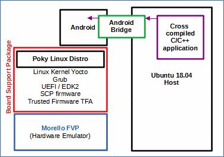

# Creating and running a "hello world" application on Android-Morello.
 [Go back to Morello Getting Started Guide.](./../../../morello-getting-started.md)

This guide demonstrates how to create a *hello world* application, cross-compile it for the Morello Platform and transfer it to Android from the host environment (Ubuntu 18.04) using the Android debug bridge.



## Overview

This document covers
1. Create the source code
2. Build the code
3. Run the Android Morello FVP
4. Use the Android debug bridge (ADB) to transfer the file
5. Run the application


## Assumptions:

You have already installed the Morello FVP and tested that it works. 

You have already installed the Android software stack and tested that it works.

## Create the source code

1. Create a hello-world directory under `morello_workspace/android/vendor/arm/morello-examples` 

```
mkdir hello-world
```
2. Create a c++ `hello-world.cpp` file under the `hello-world` directory.

```c++
/*
 * hello-world test program
 */

#include <iostream>

int main(void) {

  std::cout << "hello world\n";

  return 0;
}
```
or create a c `hello-world.c` file under the `hello-world` directory.
```c
/*
 * hello-world test program
 */

#include <stdio.h>

int main(void) {

  printf("hello world\n");

  return 0;
}
```

3. Create an Android build file called `Android.bp` under the `hello-world` directory. The `compile_multilib` property can be set for either the Aarch64 ABI, the Aarch64 pure capability ABI, or both. Select the correct source file `srcs`

```
/*
 * test for hello world example
 */

cc_test {
    name: "hello-world",
    srcs: [
        "hello-world.cpp",
    ],
    // include lines below for 1. pure-cap AArchc64 pure-cap ABI "c64", 2. both AArch64 and AArchc64 "both", otherwise defaults to AArch64 ABI only
    // compile_multilib: "c64",
    //  compile_multilib: "both",
    gtest: false,
}
```

## Set up the build environment variables

In order to build the application, the environment variables need to be set up. The section on *Setting up the build environment variables for an application to run on Android* within the guide on [Downloading and building Android on Morello FVP](./morello/AndroidOnMorello/BuildingMorelloAndroid/BuildingAndroidOnMorello.md) describes how to do this, but the commands are also listed here for completeness and need to be run in the `android` directory.
```bash
source build/envsetup.sh
export LLVM_PREBUILTS_VERSION="clang-local"
export LLVM_RELEASE_VERSION="$(cd prebuilts/clang/host/linux-x86/clang-local/lib64/clang; echo *)"
lunch morello_fvp_nano-eng
```

## Build the code

1. The binary can be built from the `android` directory by running the following command. *Note: This takes 17 minutes to compile a single build on a quad core i7.*
```
m hello-world
```
If you get the error `m command not found` see section on *Issues and Work-arounds* at the bottom of the page. If the code has built correctly you should see the following build options set up 
```
============================================
PLATFORM_VERSION_CODENAME=REL
PLATFORM_VERSION=10
TARGET_PRODUCT=morello_fvp_nano
TARGET_BUILD_VARIANT=eng
TARGET_BUILD_TYPE=release
TARGET_ARCH=arm64
TARGET_ARCH_VARIANT=armv8-2a_with_caps
TARGET_CPU_VARIANT=generic
TARGET_2ND_ARCH=morello
TARGET_2ND_CPU_VARIANT=generic
HOST_ARCH=x86_64
HOST_2ND_ARCH=x86
HOST_OS=linux
HOST_OS_EXTRA=Linux-5.0.0-23-generic-x86_64-Ubuntu-18.04.3-LTS
HOST_CROSS_OS=windows
HOST_CROSS_ARCH=x86
HOST_CROSS_2ND_ARCH=x86_64
HOST_BUILD_TYPE=release
BUILD_ID=QP1A.190711.020
OUT_DIR=out
============================================
#### build completed successfully (17:04 (mm:ss)) ####
```

2. The resulting output builds are located here:

* Aarch64 ABI: `android/out/target/product/morello/data/nativetest64/hello-world`
* Pure capability ABI: `android/out/target/product/morello/data/nativetestc64/hello-world`

3. Close the terminal window.

## Run the Android Morello FVP

1. Open a new terminal window and run the Morello FVP model with Android from the `morello_workspace`.
```
./run-scripts/run_model.sh -m model/FVP_Morello/models/Linux64_GCC-6.4/FVP_Morello -f android
```
When the model is fully loaded you can press `ENTER` in the `FVP terminal_uart_ap` to get a `console: / $` prompt.

## Use the Android debug bridge (ADB) to transfer the file

To transfer the `hello-world` binary to the Morello Android model an Android bridge is required to be set up. If you followed the guide [Installing the Morello Fixed Virtual Platform,](./morello/MorelloPlatform/InstallingMorelloFVP.md) this should already be set up so that all you need to do is `push` the files across. 

1. Open a new terminal window and Navigate to the `android` directory and *push* the `hello-world` binary file into a directory on the Morello Android FVP. For the Aarch64 only type
```
adb push out/target/product/morello/data/nativetest64/hello-world/hello-world /data/nativetest64/hello-world/hello-world
```
and for the pure capability type
```
adb push out/target/product/morello/data/nativetestc64/hello-world/hello-world /data/nativetestc64/hello-world/hello-world
```
If you get an `error` trying to push the files see section on *Issues and Work-arounds*.

## Run the application
1. To run the `hello-world` application, select the `FVP terminal_uart_ap` and for the Aarch64 only type
```
/data/nativetest64/hello-world/hello-world
```
and for the pure capability type
```
/data/nativetest64/hello-world/hello-world
```
The *'hello world'* message will appear in the `FVP terminal_uart_ap` terminal.  [Go back to Morello Getting Started Guide.](./../../../morello-getting-started.md)
## Issues and work-arounds

1. build error `m command not found`
    * *Description:* The most likely problem is that the environment variables have been lost or changed if you have been running other commands or scripts within the same terminal and so you need to re-instate them. 
    * *Solution:* See the section on *Set up the build environment variables* above.
2. adb error `adb: error: failed to get feature set: device offline`
    * *Description:* An error occurs when trying to push files across the adb bridge.
    * *Solution:* Make sure that you are in the `android` directory. You can check that a device is attached using the command `adb devices`. Then try running the `push` command again. If this still doesn't fix the problem you may need to set up the bridge again. See section *Running the Android debug bridge (ADB) to connect to the shell of the FVP* in [Downloading and building Android on Morello FVP](./morello/AndroidOnMorello/BuildingMorelloAndroid/BuildingAndroidOnMorello.md) 