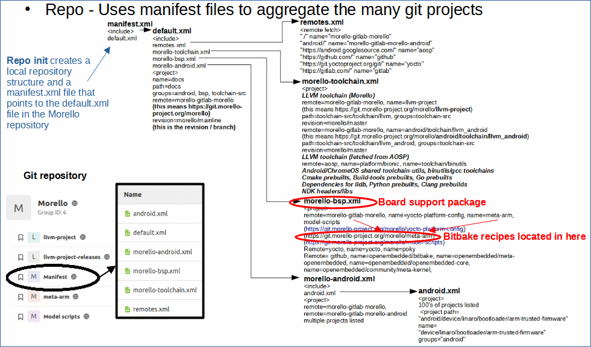

# Understanding the Repo Tool and the Morello Android Manifest Hierarchy.

 [Go back to Morello Getting Started Guide.](./../../../morello-getting-started.md)

 ## Overview

 Repo is a tool used to manage lots of git repositories for a project. Morello-Android for example uses many git repositories which can be downloaded under a single Repo command. 
 
 A `Manifest` repository is used to contain files that link to all the git repositories. The manifest files are arranged in a hierarchical order with `default.xml` being at the top, linking to the other manifest files. 

 The `Repo init` command creates a local repository structure and a manifest.xml file that points to the default.xml file in the Morello repository.

 