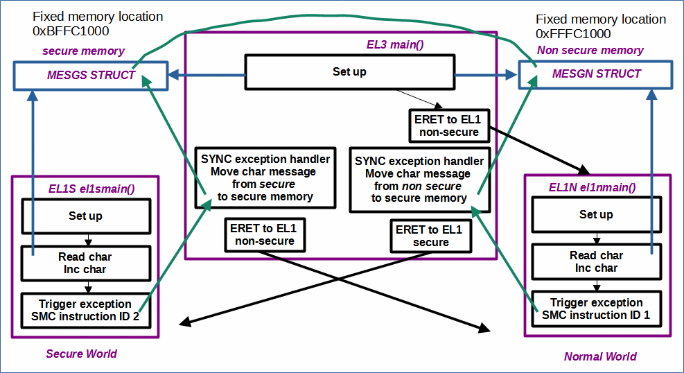
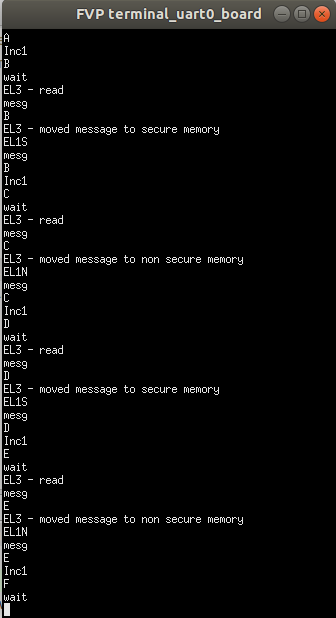

# EL1NToEL3ToEL1SSMC

 [Go back to Morello Getting Started Guide.](./../../../../morello-getting-started.md)

## Overview of EL1NToEL3ToEL1SSMC

This example shows how to use the SMC instruction to pass messages between EL1N (normal world) and EL1S (secure world). 

The example sets up the mmu, uart, and a message structure in a fixed secure memory location and a fixed non secure memory location for passing messages from EL1N to EL1S and back again (via EL3). It demonstrates the use of the SMC instruction to call back into EL3, and the ERET instruction to switch worlds. 

A vector table at EL3 catches the SMC synchronous exception in order to pass the message and switch worlds. Each time it passes into EL1N or EL1S the character part of the message is incremented i.e A, B, C etc... The code starts by doing an ERET from EL3 to the normal world by default.

A timer interrupt is used to produce a wait to slow the program down. It uses the secure and non secure physical timer, the interrupt controller and the exception vector table.

The program runs continuously, but can be stopped after a few seconds to see the characters being incremented.

## Program Structure




## Example code set up

**Message structure location:** The messages are placed at a fixed location in memory as shown below:

* fixed secure memory location (0xBFFC1000) 
* fixed non secure memory location (0xFFFC1000)

see [EL1ToEL3SMC](./../EL1ToEL3SMC/EL1ToEL3SMC.md) for a diagram of the program memory map.


**SMC IDs:** The SMC instruction passes an identifier to identify where the SMC came from and what subsequent code should be run. The example is set up as follows:

* SMC_ID_MESGN (0x01) - non secure message ID (user define non secure IDs from 0x00 to 0x1F)
* SMC_ID_MESGS (0x20) - secure message ID (user define secure IDs from 0x20 to 0x2F)

**Exceptions and Interrupt ID to Group:** In this example code the following group configuration has been set up for the timers:

* **EL3** - Secure group 0, FIQ exceptions
* **EL1 Secure** - Secure group 0, FIQ exceptions
* **EL1 Non secure** - Non secure group 1, IRQ exceptions

**Timer:** In this example code the following timers have been used
* **EL3** - Secure physical Timer (Interrupt ID 29)
* **EL1 Secure** - Secure physical Timer (Interrupt ID 29)
* **EL1 Non secure** - non secure physical Timer (Interrupt ID 30)

**MMU set up:**
The MMUs are set up as follows:
* EL3MMU
    *  0x00000000 - 1GB device memory
    *  0x40000000 - 1GB device memory
    *  0x80000000 - 1GB program memory
    *  0xC0000000 - 1GB program memory
* EL1SMMU
    *  0x00000000 - 1GB device memory
    *  0x40000000 - 1GB device memory
    *  0x80000000 - 1GB program memory
    *  0xC0000000 - 1GB invalid
* EL1NMMU
    *  0x00000000 - 1GB device memory
    *  0x40000000 - 1GB device memory
    *  0x80000000 - 1GB invalid
    *  0xC0000000 - 1GB program memory

**UART:** This example uses  the pl011 uart at a base address of 0x1C090000.

## Files

* EL3 files:
    * EL3entry.c - main c code main() at EL3
    * el3mmusetup.s - MMU setup for EL3
    * vectorTableEL3.s - vector table for EL3
    * exceptionHandlerFuncsEL3.c - exception handler functions for EL3
    * exceptionHandlerFuncsEL3.h - exception handler functions for EL3 header file
    * exceptionRegEL3 - manipulate exception registers at EL3 
    * regForEL3.s - set up EL3 registers for routing exceptions to EL3,install vector table.
    * gicS.s - interrupt controller set up and functions for secure
    * timerS.s - timer functions for secure group 0
    * gicN.s - interrupt controller set up and functions for non secure
    * mesgEL3.c - message functions
    * mesgEL3.h - message functions header file
    * regForEL1S.s - register set up, install vector table, and ERET to EL1S
    * regForEL1N.s - register set up, install vector table, and ERET to EL1N
    * uartS.c - secure uart functions
    * uartS.h - secure uart header file
* EL1S files:
    * EL1Sentry.c - main c code el1smain() at EL1S
    * el1smmusetup.s - MMU setup for EL1S
    * vectorTableEL1S.s - vector table for EL3
    * exceptionHandlerFuncsEL1S.c - exception handler functions for EL1S
    * exceptionHandlerFuncsEL1S.h - exception handler functions for EL1S header file
    * timerS.s - timer functions for secure group 0
    * interruptRegS.s - read interrupt registers for exception
    * uartS.c - secure uart functions
    * uartS.h - secure uart header file
    * mesgEL1S.c - message functions
    * mesgEL1S.h - message functions header file
    * smcEL1S.s - SMC calls

* EL1N files:
    * EL1Nentry.c - main c code el1nmain() at EL1N
    * el1nmmusetup.s - MMU setup for EL1N
    * vectorTableEL1N.s - vector table for EL1N
    * exceptionHandlerFuncsEL1N.c - exception handler functions for EL1N
    * exceptionHandlerFuncsEL1N.h - exception handler functions for EL1N header file
    * timerN.s - timer functions for non secure group 1
    * interruptRegEL1N.s - read interrupt registers for exception
    * uartN.c - non secure uart functions
    * uartN.h - non secure uart header file
    * mesgEL1N.c - message functions
    * mesgEL1N.h - message functions header file
    * smcEL1N.s - SMC calls

* linker-script.ld - linker script

## SMC - Secure Monitor Calls

For more information on secure monitor calls see [EL1ToEL3SMC](./../EL1ToEL3SMC/EL1ToEL3SMC.md).

## Build the Project
First check the linker is pointing to the linker script correctly. Select the project, and right click, then **Properties -> C/C++ Build -> settings -> LLVM C Linker 11.0.0 -> Miscellaneous**.

```
-T/<directory name>/morello-baremetal-examples/developmentStudio/<project name>/src/linker-script.ld -v
```
Then build the project. **Project -> Build Project**

## Connect to the FVP Model
Ensure that you have already launched the FVP model. Double click `<Project>Debug.Launch` and then select `Debug`. The Debugger should connect to the target. 

## Run the Code
In the **Debug Control** window, Either run or step through the code. The UART window displays messages from EL1N/EL1S and EL3. The program runs continuously, but can be stopped after a few seconds to see the characters being incremented.



To stop the software and FVP, firstly disconnect the target from within Development Studio, and then type `CTRL+C` in the console from which the FVP was launched.

