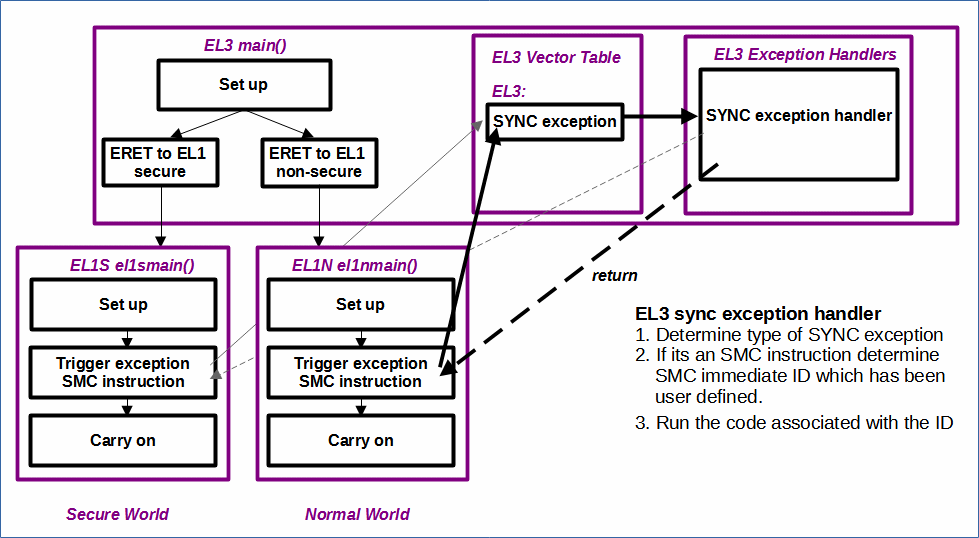
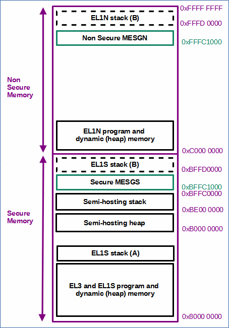
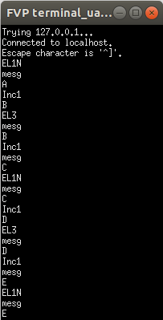

# EL1ToEL3SMC

 [Go back to Morello Getting Started Guide.](./../../../../morello-getting-started.md)

## Overview of EL1ToEL3SMC

This example shows how to use the SMC instruction to call into EL3 from either EL1N (normal world) or EL1S (secure world). 

The example sets up the mmu, uart, and a message structure in a fixed secure memory location and a fixed non secure memory location for passing messages from EL1N/EL1S to EL3 and back again. It demonstrates the use of the SMC instruction to call back into EL3. A vector table at EL3 catches the SMC synchronous exception and processes it, before returning to EL1S or EL1N. EL1S/EL1N iterates through a loop, incrementing a character within the message each time i.e A, B, C etc... The code starts by doing an ERET from EL3 to the normal world by default.

## Program Structure



## Example code set up

**Message structure location:** The messages are placed at a fixed location in memory as shown below:

* fixed secure memory location (0xBFFC1000) 
* fixed non secure memory location (0xFFFC1000) 




**SMC IDs:** The SMC instruction passes an identifier to identify where the SMC came from and what subsequent code should be run. The example is set up as follows:

* SMC_ID_MESGN (0x1) - non secure message ID
* SMC_ID_MESGS (0x2) - secure message ID

**MMU set up:** The MMUs are set up as follows:
* EL3MMU
    *  0x00000000 - 1GB device memory
    *  0x40000000 - 1GB device memory
    *  0x80000000 - 1GB program memory
    *  0xC0000000 - 1GB program memory
* EL1SMMU
    *  0x00000000 - 1GB device memory
    *  0x40000000 - 1GB device memory
    *  0x80000000 - 1GB program memory
    *  0xC0000000 - 1GB invalid
* EL1NMMU
    *  0x00000000 - 1GB device memory
    *  0x40000000 - 1GB device memory
    *  0x80000000 - 1GB invalid
    *  0xC0000000 - 1GB program memory

**UART:** This example uses  the pl011 uart at a base address of 0x1C090000.

## Files

* EL3 files:
    * EL3entry.c - main c code main() at EL3
    * el3mmusetup.s - MMU setup for EL3
    * vectorTableEL3.s - vector table for EL3
    * exceptionHandlerFuncsEL3.c - exception handler functions for EL3
    * exceptionHandlerFuncsEL3.h - exception handler functions for EL3 header file
    * exceptionRegEL3 - manipulate exception registers at EL3 
    * regForEL3.s - set up EL3 registers for routing exceptions to EL3,install vector table.
    * mesgEL3.c - message functions
    * mesgEL3.h - message functions header file
    * regForEL1S.s - register set up, install vector table, and ERET to EL1S
    * regForEL1N.s - register set up, install vector table, and ERET to EL1N
    * uartS.c - secure uart functions
    * uartS.h - secure uart header file
* EL1S files:
    * EL1Sentry.c - main c code el1smain() at EL1S
    * el1smmusetup.s - MMU setup for EL1S
    * uartS.c - secure uart functions
    * uartS.h - secure uart header file
    * mesgEL1S.c - message functions
    * mesgEL1S.h - message functions header file
    * smcEL1S.s - SMC calls

* EL1N files:
    * EL1Nentry.c - main c code el1nmain() at EL1N
    * el1nmmusetup.s - MMU setup for EL1N
    * uartN.c - non secure uart functions
    * uartN.h - non secure uart header file
    * mesgEL1N.c - message functions
    * mesgEL1N.h - message functions header file
    * smcEL1N.s - SMC calls

* linker-script.ld - linker script

## SMC - Secure Monitor Calls

After performing an ERET from EL3 to EL1N, all subsequent transitions between the non secure world and the secure world need to pass through EL3 (the Monitor). SMC instructions are used to call into EL3 using exceptions from EL1N (or EL1S). After the call has been processed by EL3 it will return to the normal world, unless an ERET instruction is given by EL3 to change to EL1S for example.

An SMC exception is a type of synchronous exception. see the SMC technical manual: https://developer.arm.com/documentation/den0028/latest/

Synchronous exceptions go to a fixed entry in a vector table, which depends upon where the exception originated, and which level the exceptions are routed to which are defined by registers. The SMC instruction however will always be routed to the EL3 vector table. Exception handler functions are necessary to read the synchronous exception register to determine the type of exception and its identifier.

For an SMC command, the ESR_EL3 register needs to be read within the exception handler. The EC field determines the type of exception. for an SMC exception EC would read b010111 (assuming AArch64). The lower 16 bits can be used to pass an SMC identifier from EL1 to EL3, which can be read by the exception handler to determine what code to run.

## Build the Project
First check the linker is pointing to the linker script correctly. Select the project, and right click, then **Properties -> C/C++ Build -> settings -> LLVM C Linker 11.0.0 -> Miscellaneous**.

```
-T/<directory name>/morello-baremetal-examples/developmentStudio/<project name>/src/linker-script.ld -v
```
Then build the project. **Project -> Build Project**

## Connect to the FVP Model
Ensure that you have already launched the FVP model. Double click `<Project>Debug.Launch` and then select `Debug`. The Debugger should connect to the target. 

## Run the Code
In the **Debug Control** window, Either run or step through the code. The UART window displays messages from EL1N/EL1S and EL3. The code stops after 5 iterations.



To stop the software and FVP, firstly disconnect the target from within Development Studio, and then type `CTRL+C` in the console from which the FVP was launched.