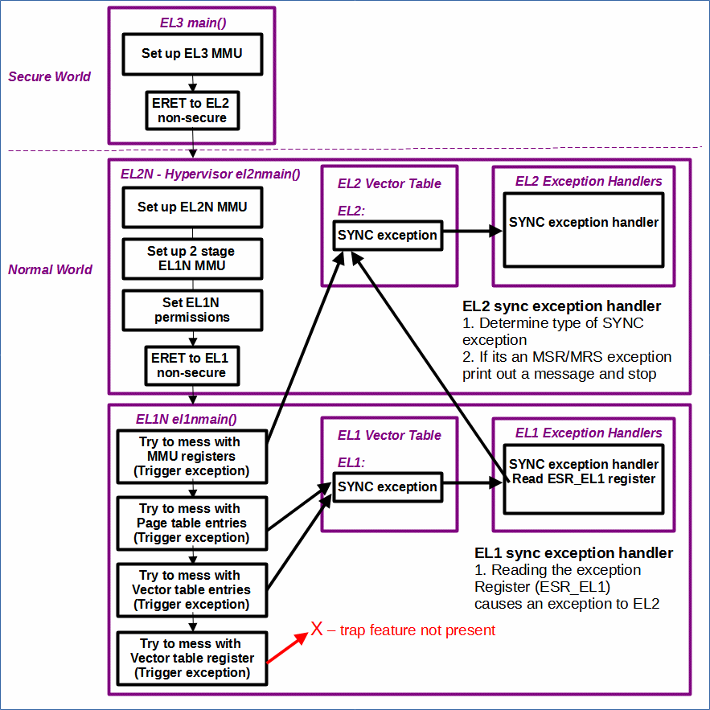
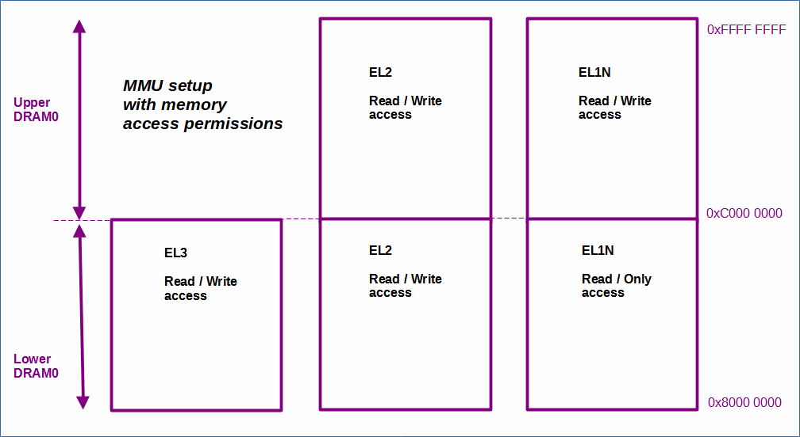
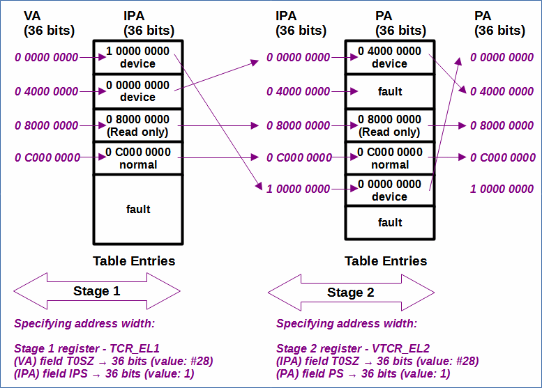
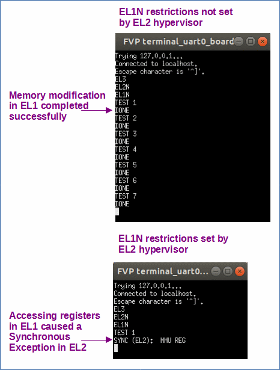

# EL2

 [Go back to Morello Getting Started Guide.](./../../../../morello-getting-started.md)

## Overview of EL2

This example shows how to use the EL2N Hypervisor mode to perform a two stage memory translation for EL1N, and restrict EL1N from reading and writing to the EL1N MMU memory registers and changing page table entries. 

**Limitations:**

At the moment, not all of the EL1/EL2 memory region is completely segregated into the desiried bounded regions by the set up of the mmu (only by the linker). Additionally, the EL3/EL2 memory region is not completely segregated (only by the linker, but not the mmu). This has been done for ease of use of the current setup and demonstrating/testing the principle of this example. Whilst this is adequate for the current setup, finer granularity of mmu setup is required, and follow on work involving performing a memory sweep of EL1N memory by EL2 will require a greater granularity of memory seperation. This can be achieved by implementing both of the following:

* Defining more memory regions within the linker script and placing program memory in the new regions (this has now been done).
* Defining more granularity of memory regions within the translation tables (current example is defined in 1GB blocks). This may involve more than one table level of translation (not yet been done).

It also appears that the nested virtualisation feature is not present in the Morello platform, implying that there is no option to trap a VBAR_EL1 access from EL1 to EL2. This means that EL1 could change where the Vector Table register is pointing to in memory, and thus change the exception handlers when a write occurs to a read only memory location.

## Program structure

A hypervisor at EL2, supporting virtualisation, introduces two stages of memory translation for code running at EL1 (see section 6 of the Armv8-A Address Translation document for more details  https://developer.arm.com/documentation/100940/0101/). In a typical system the Operating System (OS) at EL1 controls the first stage of translation to an Intermediate Physical Address (IPA). This is the **pretend** physical address that the OS at EL1 thinks it is interfacing to. The Hypervisor at EL2 then translates this to the **real** physical address (PA). 

Within this code example however, we would like to control both stages of translation from within the hypervisor at EL2, and restrict EL1's access by disabling it's ability to modify the memory translation.

As shown in the program structure diagram, when EL1N restrictions are in place (`Set EL1N permissions`), if EL1N tries to modify the MMU registers or memory translation in any way, an exception is triggered. If an attempt to access a register is made, the synchronous exception is routed directly to the vector table at EL2. If an attempt is made to write to the memory location of the table entries, a synchronous exception is routed to the vector table at EL1. The EL1 exception handler attempts to read the exception register (ESR_EL1) to determine the cause of the exception, which in turn triggers an exception routed to the vector table at EL2. The handler prints out a message and stops the program.

It should be noted that when EL1 tries to overwrite page table entries in memory, the exception gets routed to the EL1 vector table, and not the EL2 vector table. This may give rise to a potential issue because EL1 has access to the EL1 vector table pointer register and could potentially change where it is pointing to and hence change what happens when this exception occurs. As a precaution EL2 has been written to put the EL1 vector table in read only memory as well as the translation tables so they can not be modified. It is also possible to trap EL1 accessing the VBAR register (pointer to the vector table), if the nested virtualisation feature is implemented. However, it currently appears that the nested vrtualisation feature is not implemented in Morello because an attempt to set the NV1 bit of the HCR_EL2 register to trap VBAR_EL1 to EL2 did not work. So although the page tables can not be modified in memory and causes an exception, it is possible for EL1 to change what happens when that exception occurs.

https://developer.arm.com/documentation/102142/0100/Nested-virtualization

In addition to this two stage memory translation for EL1, it should be remembered that both the EL2 Hypervisor and EL3 will need to have their own memory translation which are single stage VA to PA.

Note: that **stages** (stages of translation) are not to be confused with **levels** (levels of translation), which are associated with defining granularity of memory regions.



## Files

* EL3 files:
    * EL3entry.c - main c code main() at EL3
    * el3mmusetup.s - MMU setup for EL3
    * regForEL2N.s - register set up, and ERET to EL2N
    * uartS.c - secure uart functions in EL3 memory space
    * uartS.h - secure uart header file in EL3 memory space
* EL2N files:
    * EL2Nentry.c - main c code el2nmain() at EL2N
    * regForEL2N.s - entry to EL2N, disable EL1N functions
    * el2nmmusetup.s - MMU setup for EL2N
    * vectorTableEL2N.s - vector table for EL2
    * regForEL1N.s - register set up, and ERET to EL1N
    * el2_stg1ForEL1nmmusetup.s - stage 1 translation for EL1N
    * el2_stg2ForEl1nmmusetup.s - stage 2 translation for EL1N
    * exceptionHandlerFuncsEL2N.c - exception handler functions for EL2N
    * exceptionHandlerFuncsEL2N.h - exception handler functions for EL2N header file
    * uartEL2N.c - non secure uart functions in EL2 memory space
    * uartEL2N.h - non secure uart header file in EL2 memory space
* EL1N files:
    * EL1Nentry.c - main c code el1nmain() at EL1N
    * regForEL1N.s - entry to EL1N
    * vectorTableEL1N.s - vector table for EL1N
    * uartN.c - non secure uart functions in EL1N memory space
    * uartN.h - non secure uart header file in EL1N memory space
    * el1nMemAccess.s - functions to try to change the EL1N MMU settings
    * exceptionHandlerFuncsEL1N.c - exception handler functions for EL1N
    * exceptionHandlerFuncsEL1N.h - exception handler functions for EL1N header file

* linker-script.ld - linker script

## Linker memory map encompassing EL2

The linker script is used to place program code into the seperate DRAM0 memory regions for EL3/EL2/EL1N. The linker memory map is shown below.


## MMU memory map encompassing EL2

The MMU set up of DRAM0 memory for each EL is shown. The memory is currently split into 1GB blocks, but future modifications will include a finer granularity to better coincide with the linker script set up. 




## Two stage EL1N memory translation

In the most basic two stage translation set up, the memory regions can be flat mapped across both stages of translation, so that the VA is the same as the IPA, which is the same as the PA. This example however demonstrates how regions of memory, defined by the Virtual Address (VA), can be translated to a different region in the Intermediate Physical Address (IPA), before being translated to the actual Physical Address (PA) space. 

The diagram below shows the two stages of translation used within this example. 



To aid with the understanding of the two stage set up, the EL1N memory set up used in previous examples (using a single stage) is given below and briefly explained. The first two GB of memory regions are device memory, and the second two are program memory. The first region of program memory is set up as being invalid for EL1N since it is reserved for secure world memory. There is a direct translation between the input and output address of the translation table.

* EL1NMMU
    *  0x00000000 - 1GB device memory
    *  0x40000000 - 1GB device memory
    *  0x80000000 - 1GB invalid (fault)
    *  0xC0000000 - 1GB program memory 

For the two stage set up, the device memory regions are firstly translated to a different address, that is VA 0x000000000 is translated to IPA 0x100000000, and VA 0x40000000 is translated to IPA 0x000000000. This has been performed to illustrate how the mapping works, both in principle, and within the code. The program memory regions are slightly different in that the lower DRAM0 section has also been translated, which contain the page tables and vector tables for EL1N, and since the region is controlled by EL2 it can be set to **read only** to prevent the page table entries from being modified in memory. During the second stage of translation the device memory regions are translated to the physical address. That is IPA 0x000000000 is translated to PA 0x040000000, and IPA 0x100000000 is translated to PA 0x000000000. Invalid memory regions are set up as having a fault.

## Specifying VA/IPA/PA address widths

In both stages of translation the VA/IPA/PA use a 36 bit address space. These are defined by setting the correct fields within the stage 1 register (TCR_EL1) and stage 2 register (VTCR_EL2). The set up of these fields are summarised in the two stage translation diagram, and described here in full since their values are not straight forward.

For stage one translation the T0SZ[5:0] field of the TCR_EL1 specifies the VA bit width. the value within the T0SZ field is the number that needs to be subtracted from 64 to arrive at the required bit width. For example if 36 bits are required, then the T0SZ field will need to be loaded with the value #28 (or hex #0x1C), and not 36 (`64 - 28 = 36 bits`). See TCR_EL1 register definition https://developer.arm.com/documentation/ddi0595/2020-12/AArch64-Registers/TCR-EL1--Translation-Control-Register--EL1-?lang=en#fieldset_0-34_32 

The IPS[34:32] field of the TCR_EL1 specifies the IPA bit width which is encoded in a different format using 3 bits. The specified bit width needs to be in the range 32 to 52, incrementing in twos.

* 000 - 32 bits, 4GB
* **001 - 36 bits, 64GB**
* 010 - 40 bits, 1TB
* ... etc
* 110 - 52 bits, 4PB

The bit width highlighted (36 bits) is the encoding used in this example.

For stage two translation the T0SZ[5:0] field of the VTCR_EL2 specifies the IPA bit width and is set in the same way as stage 1 T0SZ. The PS[34:32] field of the VTCR_EL2 specifies the PA bit width and is also set in the same way as stage 1 IPS.


## Block Entry format for stage 2 translation

The block entry format for stage 2 also needs detailing here since although it is similar to stage 1, there are differences in the the Attribute fields. There is no MAIR register so the memory attributes are encoded directly into the attribute fields.

The format for a block entry (4KByte granule size level 1 table) is as follows:

|Upper Block Attributes|Res0|Output Address [47:30]|Res0|Lower Block Attributes|0|1|

* Lower Block Attributes - 10 bits
    * |0 AF SH[1:0] S2AP[1:0] MemAttr[3:0]|

For **stage 1** translation the first **three** bits of the **Lower Block Attributes MemAttr[2:0] (bit[4:2])** indexed an 8-bit memory attribute within the MAIR register.

For **stage 2** translation the first **four** bits of the **Lower Block Attributes MemAttr[3:0] (bit[5:2])** defines the memory attribute directly. See https://armv8-ref.codingbelief.com/en/chapter_d4/d43_3_memory_attribute_fields_in_the_vmsav8-64_translation_table_formats_descriptors.html, however it is not a direct replacement since you will notice that stage 1 is defined by an 8-bit memory attribute, and stage 2 is defined by a 4-bit memory attribute. The descriptors in the stage 2 translations define a second level of memory region attributes that are overlaid onto the stage 1 attributes. See the armv8-a technical reference manual, Section D5.5.3 Stage 2 memory region type and Cacheability attributes: https://developer.arm.com/documentation/ddi0487/latest/.

The stage 2 attributes are defined as follows:

**Stage 2 MemAttr[3:0]**

* **Device Memory:**
    * **hex:0x0  bin:0000   - Device-nGnRnE**
    * hex:0x1  bin:0001   - Device-nGnRE
    * hex:0x2  bin:0010   - Device-nGRE
    * hex:0x3  bin:0011   - Device-GRE
* **Normal Memory:**
    * hex:0x5  bin:0101     - Outer non-cacheable, Inner non-cacheable
    * hex:0x9  bin:1001     - Outer write-through cacheable, Inner non-cacheable
    * hex:0xD  bin:1101     - Outer write-back cacheable, Inner non-cacheable
    ----
    * hex:0x6  bin:0110     - Outer non-cacheable, Inner write-through cacheable
    * hex:0xA  bin:1010     - Outer write-through cacheable, Inner write-through cacheable
    * hex:0xE  bin:1110     - Outer write-back cacheable, Inner write-through cacheable
    ----   
    * hex:0x7  bin:0111     - Outer non-cacheable, Inner write-back cacheable
    * hex:0xB  bin:1011     - Outer write-through cacheable, Inner write-back cacheable
    * **hex:0xF  bin:1111     - Outer write-back cacheable, Inner write-back cacheable**

The two memory formats highlighted have been used in this example.

Stage 1 format is described in [Understanding the default MMU set up at EL3.](./../../../../MMU.md)


## Restricting EL1N access from modifying the memory and translation tables

The HCR_EL2 register is the hypervisor configuration register (https://developer.arm.com/documentation/ddi0595/2020-12/AArch64-Registers/HCR-EL2--Hypervisor-Configuration-Register) and allows controls to be set for virtualization including defining what operations are trapped to EL2 via an exception.

To prevent EL1N from modifying the MMU set up, a trap of EL1N MMU memory register access can be achieved by setting bits [26] and [30]. With this set up the following registers are trapped to EL2 (MSR/MRS exception) and reported using EC syndrome value 0x18:

  * SCTLR_EL1, TTBR0_EL1, TTBR1_EL1, TCR_EL1, ESR_EL1, FAR_EL1, AFSR0_EL1, AFSR1_EL1, MAIR_EL1, AMAIR_EL1, CONTEXTIDR_EL1

  where:

  * bit[26] TVM traps writes
  * bit[30] TRVM traps reads

  To prevent EL1N from modifying the page tables directly in memory, the memory region of where the page tables are located need to be set to **read only** for EL1N. Since EL2 needs access to the memory location of where the page table entries are stored in memory to create them in the first instance, and EL1 needs access to do the translation which is pointed to by the translation table register for EL1, the memory region needs to be in both the EL1 space and the EL2 space. This is shown by the MMU setup diagram and linker memory map. When the EL2 space is set up, the access permissions for the region needs to be set to read/write. When the EL1 space is set up, the access permissions need to be set to read only. This is all controlled by EL2 when the mmu configurations are set up. Any violation causes a data abort memory access fault, and generates an exception that is routed to the EL1N vector table. Note that no bits are required to be set in the HCR_EL2 register for this.

  As highlighted previously EL1 has access to the EL1 vector table pointer register and could potentially change where it is pointing to and hence change what happens when EL1 exceptions occur. An attempt to trap the VBAR register to EL2 did not work as it appears that the nested vrtualisation feature is not implemented in Morello, however it was possible to place the vector table and its exception handlers in read only memory. To trap the VBAR register the following bit needs to be set:

  * bit[43] NV1 traps VBAR_EL1 as well as some other registers 


## Build the Project
First check the linker is pointing to the linker script correctly. Select the project, and right click, then **Properties -> C/C++ Build -> settings -> LLVM C Linker 11.0.0 -> Miscellaneous**.

```
-T/<directory name>/morello-baremetal-examples/developmentStudio/<project name>/src/linker-script.ld -v
```
Then build the project. **Project -> Build Project**

## Connect to the FVP Model
Ensure that you have already launched the FVP model. Double click `<Project>Debug.Launch` and then select `Debug`. The Debugger should connect to the target. 

## Run the Code
In the **Debug Control** window, Either run or step through the code. The UART window displays messages. Modify the code in EL2 to either set or unset the memory restrictions for EL1N. Modify the code in EL1N to run specific memory tests. If restrictions on EL1N are not set, then the EL1N memory modifications can complete and a `Done` message appears. If restrictions are placed on EL1N by EL2 hypervisor, then the memory modifications can not complete, instead a synchronous exception occurs and a `SYNC` message is displayed.




| Test | Output - No restrictions | Output - Read only memory on | Output - Read only and EL1 register access disabled |
| ---- | ----------------- | -------------- | --------------- |
| TEST1 - modify MAIR_EL1 register | DONE | DONE | SYNC (EL2): MMU REG |
| TEST2 - modify the translation table in memory using the TTBR0_EL1 register | DONE | DONE | SYNC (EL2): MMU REG | 
| TEST3 - modify the translation table in memory knowing the memory location | DONE | SYNC (EL1): ABORT MEM PERM | SYNC (EL1): SYNC (EL2): MMU REG |
| TEST4 - modify VBAR_EL1 register | DONE | DONE | DONE | 
| TEST5 - modify the vector table in memory knowing the memory location  | DONE | SYNC (EL1): ABORT MEM PERM | SYNC (EL1): SYNC (EL2): MMU REG |
| TEST6 - modify TCR_EL1 register | DONE | DONE | SYNC (EL2): MMU REG | 
| TEST7 - modify SCTLR_EL1 register | DONE | DONE | SYNC (EL2): MMU REG | 

To stop the software and FVP, firstly disconnect the target from within Development Studio, and then type `CTRL+C` in the console from which the FVP was launched.


## Further information
Good understandable overview of memory management: https://developer.arm.com/documentation/101811/0101/What-is-memory-management

What is stage 2 translation: https://developer.arm.com/documentation/102142/latest/Stage-2-translation

Armv8-a Address Translation: https://developer.arm.com/documentation/100940/0101/

Translation table format: https://armv8-ref.codingbelief.com/en/chapter_d4/d42_6_the_vmsav8-64_translation_table_format.html

Attribute fields for stage 2: https://armv8-ref.codingbelief.com/en/chapter_d4/d43_3_memory_attribute_fields_in_the_vmsav8-64_translation_table_formats_descriptors.html

Armv8-a technical reference manual, Section D5.5.3 Stage 2 memory region type and Cacheability attributes: https://developer.arm.com/documentation/ddi0487/latest/.