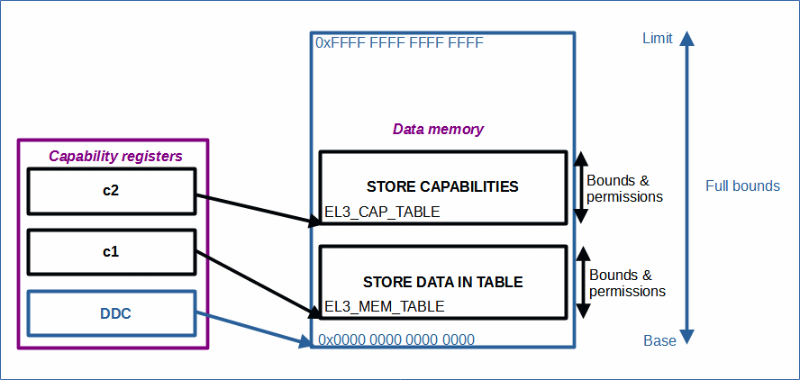

# EL3-purecap

 [Go back to Morello Getting Started Guide.](./../../../../morello-getting-started.md)

## Overview of EL3-purecap

This example explores some of the CHERI functionality in low level assembly code by manipulating capability registers and performing some tests to generate an exception. This example can be compiled for either *Morello* or *Morello-purecap*, but capability operations can only be conducted when compiled for *Morello-purecap*.

## Program structure

The program performs a number of basic capability operations using the capability instructions. The list of operations includes:

* Manipulate the Default Data Capability (DDC) register
* Create a capability pointer to a memory address to store data
* Extract the bounds and permissions of the capability
* Change the bounds of the capability
* Change the permissions of the capability
* Populate a table in memory using the capability pointer with restricted bounds and permissions
* Store and load a capability in memory

## Capabilities

**DDC**

The DDC is used as the base capability which, on reset, has all permissions set and the bounds extend to the full memory from 0x00000000 00000000 to 0xFFFFFFFF FFFFFFFF. Further data capabilities can be derived from this. It is also possible to manipulate DDC by reducing its bounds and permissions, clearing all values completely, or even deriving a new capability from another capability register. 

Within this example code all new capabilities are derived from DDC. However the default initialisation code (prior to main) clears this register and so the example code firstly derives a new DDC capability from another capability register.

**Capability 1 - pointer to a memory location in which to read and write data**

Within the example code, capability 1 (c1) is derived from the DDC, and is a pointer to a memory location in which to read and write data into a table in memory. The value field holds the address of the memory location. Since it is not easily observable as to what the bounds of the capability are due to its compressed format, a number of instructions can be used to uncompress them into a readable register:

* `GCBASE` - get the **base bounds** of the capability and put it into an ordinary register for reading. This operation uncompresses the base format.
* `GCLIM` - get the **limit bounds** of the capability and put it into an ordinary register for reading. This operation uncompresses the limit format.
* `GCLEN` - get the **length of the bounds** of the capability and put it into an ordinary register for reading. This operation uncompresses and works out the length.
* `GCPERM` - get the **permissions** of the capability and put it into an ordinary register for reading. 

**Changing the bounds of a capability**

It is only possible to reduce the bounds of a capability, not increase it. If it is increased, the tag bit is cleared causing the capability to become invalid. The example code explores changing the bounds.

* `SCBNDSE` - set the bounds exactly by setting the **length** of the bounds from the address value.

**Changing the permissions of a capability**

It is only possible to reduce the permissions of a capability, not increase them. Permissions are removed by setting the bit corresponding to the specific permission using the permission instruction. The example code explores changing the permissions.

* `CLRPERM` - clear permission as follows:

    * [17] load
 	* [16] store
 	* [15] execute
 	* [14] load cap
 	* [13] store cap
 	* [12] store local cap
 	* [11] seal
 	* [10] unseal
 	* [9] system
 	* [8] branch sealed pair
 	* [7] compartment ID
 	* [6] mutable load
 	* [5:2] User[4]

**Capability 2 - Storing and loading a capability into memory**

It is possible to store and load capabilities in memory. In order to do this a second capability pointer (c2) is required, which points to the memory location of where the first capability is to be stored. The example code explores storing and loading capabilities.

* `STR` - store capability into a memory location
* `LDR` - load capability from a memory location

## Files

* EL3 files:
    * EL3-purecap.c - main c code main() at EL3 which calls the assembly functions
    * el3testspurecap.S - assembly functions for manipulating capabilities (Uppercase `S` extension required for preprocessing)

## CHERI Assembly code and the LLVM compiler

For low-level coding where system registers and capability registers are manipulated directly within assembly code, the following LLVM compiler options are translated to preprocess code as follows:

* target: morello ->      `__CHERI__`
* target: +c64 -> `__ARM_FEATURE_C64`
* abi: purecap -> `__CHERI_PURE_CAPABILITY__`

In the examples used here, only the `__CHERI_PURE_CAPABILITY__` is checked for since we are only compiling for *Morello*, or *Morello-purecap*, but the others need to be included in the settings because initialisation code built into the llvm compiler still use them. (since we can not have pure capability without the `__ARM_FEATURE_C64`. Also, `__CHERI__` was used for hybrid capability and is legacy).

For automatic preprocessing by the **LLVM compiler** the assembly file **must have** an **uppercase** `S` extension.

## Build the Project

Build the project. **Project -> Build Project**

## Connect to the FVP Model
Ensure that you have already launched the FVP model. Double click `<Project>Debug.Launch` and then select `Debug`. The Debugger should connect to the target. 

## Run the Code
In the **Debug Control** window, step through the code to read the registers within the debugger to see the bounds and permissions being changed. Below shows the bounds and permissions being read from c1 into x2, during part of the `el3BoundsTest()` function.

To stop the software and FVP, firstly disconnect the target from within Development Studio, and then type `CTRL+C` in the console from which the FVP was launched.