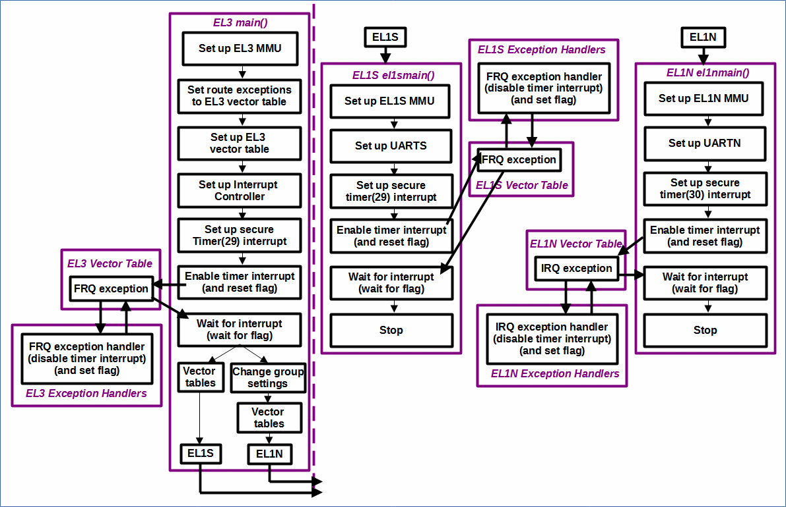

# EL3MMUEL1MMUUARTTimerInterrupt

 [Go back to Morello Getting Started Guide.](./../../../../morello-getting-started.md)

## Overview of EL3MMUEL1MMUUARTTimerInterrupt

This example code sets up the MMU at EL3, installs the vector tables for exception handling, sets up the interrupt controller, and performs a timer interrupt for secure physical timer at secure group 0. The code writes messages to the console window.

If the code branches to EL1 secure, it sets up the EL1 secure vector table and MMU mapping of the secure memory region and device memory, and a secure version of the UART. It then performs a timer interrupt for secure physical timer at secure group 0. The code writes messages to the UART window.

If the code branches to EL1 non secure, it sets up the EL1 non secure vector table and MMU mapping of the non secure memory region and device memory, and a non secure version of the UART. It then performs a timer interrupt for non secure physical timer at non secure group 1. The code writes messages to the UART window.

This example sets up a LLVM-LD linker script to define secure and non-secure regions of memory in which to load the secure and non-secure software.

## Program Structure




## Example code set up

This gives an overview of the settings used. see [EL3MMUTimerInterrupt](./../EL3MMUTimerInterrupt/EL3MMUTimerInterrupt.md) for a more detailed description of the settings.

**Exceptions and Interrupt ID to Group:** In this example code the following group configuration has been set up:

* **EL3** - Secure group 0, FIQ exceptions
* **EL1 Secure** - Secure group 0, FIQ exceptions
* **EL1 Non secure** - Non secure group 1, IRQ exceptions

**Timer:** In this example code the following timers have been used
* **EL3** - Secure physical Timer (Interrupt ID 29)
* **EL1 Secure** - Secure physical Timer (Interrupt ID 29)
* **EL1 Non secure** - non secure physical Timer (Interrupt ID 30)

**MMU set up:**
The MMUs are set up as follows:
* EL3MMU
    *  0x00000000 - 1GB device memory
    *  0x40000000 - 1GB device memory
    *  0x80000000 - 1GB program memory
    *  0xC0000000 - 1GB program memory
* EL1SMMU
    *  0x00000000 - 1GB device memory
    *  0x40000000 - 1GB device memory
    *  0x80000000 - 1GB program memory
    *  0xC0000000 - 1GB invalid
* EL1NMMU
    *  0x00000000 - 1GB device memory
    *  0x40000000 - 1GB device memory
    *  0x80000000 - 1GB invalid
    *  0xC0000000 - 1GB program memory

**UART:** This example uses  the pl011 uart at a base address of 0x1C090000.

## Files

* EL3 files:
    * EL3entry.c - main c code main() at EL3
    * el3mmusetup.s - MMU setup for EL3
    * vectorTableEL3.s - vector table for EL3
    * exceptionHandlerFuncsEL3.c - exception handler functions for EL3
    * exceptionHandlerFuncsEL3.h - exception handler functions for EL3 header file
    * regForEL3.s - set up EL3 registers for routing exceptions to EL3,install vector table.
    * gicS.s - interrupt controller set up and functions for secure
    * timerS.s - timer functions for secure group 0
    * gicN.s - interrupt controller set up and functions for non secure
    * regForEL1S.s - register set up, install vector table, and ERET to EL1S
    * regForEL1N.s - register set up, install vector table, and ERET to EL1N
* EL1S files:
    * EL1Sentry.c - main c code el1smain() at EL1S
    * el1smmusetup.s - MMU setup for EL1S
    * vectorTableEL1S.s - vector table for EL1S
    * uartS.c - secure uart functions
    * uartS.h - secure uart header file
    * timerS.s - timer functions for secure group 0
    * exceptionHandlerFuncsEL1S.c - exception handler functions for EL1S
    * exceptionHandlerFuncsEL1S.h - exception handler functions for EL1S header file

* EL1N files:
    * EL1Nentry.c - main c code el1nmain() at EL1N
    * el1nmmusetup.s - MMU setup for EL1N
    * vectorTableEL1N.s - vector table for EL1N
    * uartN.c - non secure uart functions
    * uartN.h - non secure uart header file
    * timerN.s - timer functions for non secure group 1
    * exceptionHandlerFuncsEL1N.c - exception handler functions for EL1N
    * exceptionHandlerFuncsEL1N.h - exception handler functions for EL1N header file

* linker-script.ld - linker script

## Build the Project
First check the linker is pointing to the linker script correctly. Select the project, and right click, then **Properties -> C/C++ Build -> settings -> LLVM C Linker 11.0.0 -> Miscellaneous**.

```
-T/<directory name>/morello-baremetal-examples/developmentStudio/<project name>/src/linker-script.ld -v
```
Then build the project. **Project -> Build Project**

## Connect to the FVP Model
Ensure that you have already launched the FVP model. Double click `<Project>Debug.Launch` and then select `Debug`. The Debugger should connect to the target. 

## Run the Code
In the **Debug Control** window, Either run or step through the code. A message will appear in the console from EL3, and in the UART window from EL1S or EL1N.

To stop the software and FVP, firstly disconnect the target from within Development Studio, and then type `CTRL+C` in the console from which the FVP was launched.