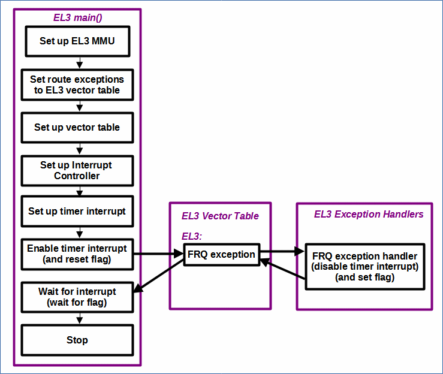

# EL3MMUTimerInterrupt

 [Go back to Morello Getting Started Guide.](./../../../../morello-getting-started.md)

## Overview of EL3MMUTimerInterrupt

This example code sets up the MMU at EL3, installs the vector tables for exception handling, sets up the interrupt controller, and performs a timer interrupt for secure physical timer at secure group 0. The code writes messages to the console window.

## Program Structure



## Example code set up

This gives an overview of the settings used. The subsequent sections describe them in more detail.

**Exceptions:** In this example FIQ exceptions are used for secure EL3.

**Interrupt ID to Group:** In this example the following Interrupt ID - Group configuration has been set up:

* **EL3** - Secure group 0, FIQ exceptions

**Timer:** - In this example the Secure physical Timer (Interrupt ID 29) is used.

## Files

* EL3MMUTimerInterrupt.c - main c code main() at EL3
* el3mmusetup.s - MMU setup for EL3
* vectorTableEL3.s - vector table for EL3
* exceptionHandlerFuncsEL3.c - exception handler functions for EL3
* exceptionHandlerFuncsEL3.h - exception handler functions for EL3 header file
* regForEL3.s - set up EL3 registers for routing exceptions to EL3
* gic.s - interrupt controller set up and functions
* timer.s - timer functions for secure group 0
* linker-script.ld - linker script

## MMU Set up

The MMU is set up as follows:
* EL3MMU
    *  0x00000000 - 1GB device memory - GIC base address 0x30000000
    *  0x40000000 - 1GB device memory
    *  0x80000000 - 1GB program memory
    *  0xC0000000 - 1GB program memory

## Vector Table

The EL3 vector table handles all of the exceptions that are routed to EL3. This example only deals with the secure physical timer interrupt exception, and therefore there is only one exception handler to process it.

The vector table follows the standard vector table format for the AArch64 setup, see https://developer.arm.com/documentation/100933/0100/AArch64-exception-vector-table. Each exception level (EL3, EL2, EL1) should have its own vector table. This example only operates at EL3 so there is only one vector table.

The base address for the EL3 vector table is given by VBAR_EL3, which in this project is defined in regForEL3.s. Each entry has a defined offset from this base address of 128 bytes. Additionally, each table has a defined number of entries in a defined format of 4 sets of 4 entries to cover the different types, and where the exception is being taken from. The table contains branch instructions to an exception handler function, but it is possible to write up to 32 instructions here for each entry. In the specific table defined here, entries not used are branch to self (B .)

## Exceptions
There are four types of exceptions. See https://developer.arm.com/documentation/102412/0100/Exception-types 

* Synchronous - caused by invalid instructions or memory accesses
* IRQ - asynchronous exception for physical interrupts (e.g can be used for non secure)
* FRQ - asynchronous exception for physical interrupts (e.g can be used for secure)
* SError - asynchronous exception, erroneous memory accesses, such as error on memory bus

IRQ and FRQ exceptions have the same priority in ARMv8A and can therefore be used for seperating non secure and secure interrupts (but this is not mandatory).

**This Example:** In this example FIQ exceptions are used for secure.

## GIC (600) - General Interrupt Controller

The Morello board uses the 600 version of the GIC which requires extra power management. To use the Interrupt controller there are both system registers and memory mapped registers that need to be accessed. More details regarding the GIC memory map for Morello can be found on the [Understanding the Morello Memory Map](./../../DefaultSetup/MemMap/MemMap.md) page.

## Assigning Interrupt ID's to a Group

Each interrupt, such as the secure physical timer has a unique interrupt ID (29).
Assigning an Interrupt ID to a Group determines the type of interrupt (FIQ) or (IRQ), which in turn determines where it branches to in the vector table to perform an interrupt handler routine.

The different groups are documented in the GIC-600 manual - Section 3.8, Table 3-1 and Table 3-2 
https://developer.arm.com/documentation/100336/0106/introduction/about-the-gic-600

There are three groups, which can be assigned to different ELs and security states by setting up the appropriate registers. For example, the following would be a valid configuration:

* **EL3** - Secure group 0, FIQ exceptions
* **EL1 Secure** - Secure group 1, FIQ exceptions
* **EL1 Non secure** - Non secure group 1, IRQ exceptions

To set the interrupt group for each interrupt ID you need to set the group and modifier registers. The group is also dependent on GICD_CTLR.DS and if affinity routing is enabled:

Registers: (modbit and groupbit)
* GICD_IGRPMODRn and GICD_IGROUPRn
* or GICR_IGRPMODR0 and GICR_IGROUPR0

Each bit in the register represents an interrupt ID, the same bit of two registers is concatenated to form a 2-bit field that defines the interrupt group.

If affinity routing is enabled AND GICD_CTLR.DS==0 (secure aware)
 * modbit(0)  groupbit(0) - secure group 0
 * modbit(0)  groupbit(1) - Non secure group 1
 * modbit(1)  groupbit(0) - Secure group 1
 * modbit(1)  groupbit(1) - Reserved treated as non secure group 1

If affinity not enabled AND if GICD_CTLR.DS==0 (secure aware)
  * modbit(reserved) groupbit(0) - secure group 0
  * modbit(reserved) groupbit(1) - Non secure group 1

Whether the interrupt is FIQ, or IRQ is additionally determined by the current Exception level and security state.

When reading the status of the interrupts it is additionally important to read from the correct group register. For example 

  * This is group 0 register which is always for secure
    * ICC_EOIR0_EL1 - Interrupt Controller End Of Interrupt Register
  * This is group 1 register which can be for secure or non secure
    * ICC_EOIR1_EL1 - Interrupt Controller End Of Interrupt Register

**This example:** In this example the following Interrupt ID - Group configuration has been set up:

* **EL3** - Secure group 0, FIQ exceptions

## Timers

There are seven possible timers:

* EL3 secure physical timer - ID 29
* EL1 physical timer - ID 30
* EL2 non secure physical timer - ID 26
* EL2 secure physical timer - ID 20
* EL1 Virtual Timer - ID 27
* EL2 non secure virtual timer - ID 28
* EL2 secure virtual timer -ID 19

**This example:** This example uses the EL3 secure physical timer - ID 29.

Further information regarding which registers to use for this timer can be found here, and you can also download the manual:
https://developer.arm.com/documentation/102379/0000/The-processor-timers?lang=en

## Build the Project
First check the linker is pointing to the linker script correctly. Select the project, and right click, then **Properties -> C/C++ Build -> settings -> LLVM C Linker 11.0.0 -> Miscellaneous**.

```
-T/<directory name>/morello-baremetal-examples/developmentStudio/<project name>/src/linker-script.ld -v
```
Then build the project. **Project -> Build Project**

## Connect to the FVP Model
Ensure that you have already launched the FVP model. Double click `<Project>Debug.Launch` and then select `Debug`. The Debugger should connect to the target. 

## Run the Code
In the **Debug Control** window, Either run or step through the code. A message will appear in the console from EL3.

To stop the software and FVP, firstly disconnect the target from within Development Studio, and then type `CTRL+C` in the console from which the FVP was launched.