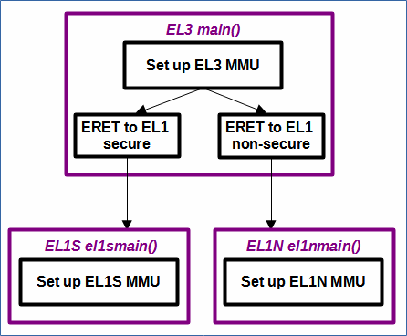

# EL3MMUToEL1MMU - Changes the exception level from EL3 to either EL1 secure or EL1 non-secure, and sets up the MMUs at each level.

 [Go back to Morello Getting Started Guide.](./../../../../morello-getting-started.md)

## Overview of EL3MMUToEL1MMU
This example sets up a LLVM-LD linker script to define secure and non-secure regions of memory in which to load the secure and non-secure software. The example code sets up the MMU in EL3, changes the exception level from EL3 to either EL1 secure (and sets up the MMU mapping of secure memory region and device memory) or EL1 non-secure (and sets up the MMU mapping of non secure memory region and device memory).

**Limitations and known issues:** 

The c library functions are stored in secure memory. See [EL3ToEL1](./../EL3ToEL1/EL3ToEL1.md) for a more detailed explanation.

There were some issues with the debugger displaying warnings about the MMU set up in EL1 when the TTBR1 (not present in EL3) table register was not set up with valid values, even though it has been disabled and not used. Some extra code was added to remove the warnings by setting sensible values. In practice this should not be necessary.

There was an additional debugger MMU warning about a VSTCR_EL2 register (control register for stage 2 of the Secure EL1&0 translation regime) not being configured, even though it was not present. This register is present only when FEAT_SEL2 is implemented which is enabled from EL3 using the SCR_EL3 register (secure configuration register) and setting bit EEL2 [18] to 1. At present this has not affected the program code, but the warning has yet to be resolved.

## Program Structure




## Files

The files consist of the following

* EL3entry.c - main c code main() at EL3
* EL1Sentry.c - main c code el1smain() at EL1S
* EL1Nentry.c - main c code el1nmain() at EL1N
* regForEL1N.s - set up of registers and ERET to EL1N
* regForEL1S.s - set up of registers and ERET to EL1S
* el3mmusetup.s - MMU setup for EL3
* el1smmusetup.s - MMU setup for EL1 secure
* el1nmmusetup.s - MMU setup for EL1 non secure
* linker-script.ld - linker script


## Linker script and Specifying Memory Regions

The linker script specifies two program memory regions within DRAM0 which is 2GB in size.
*  0x80000000 - 1GB secure
*  0xC0000000 - 1GB non secure

Program code is assigned to each region, together with seperate stacks for EL1S and EL1N.

## MMUs set up

The MMUs are set up as follows:
* EL3MMU
    *  0x00000000 - 1GB device memory
    *  0x40000000 - 1GB device memory
    *  0x80000000 - 1GB program memory
    *  0xC0000000 - 1GB program memory
* EL1SMMU
    *  0x00000000 - 1GB device memory
    *  0x40000000 - 1GB device memory
    *  0x80000000 - 1GB program memory
    *  0xC0000000 - 1GB invalid
* EL1NMMU
    *  0x00000000 - 1GB device memory
    *  0x40000000 - 1GB device memory
    *  0x80000000 - 1GB invalid
    *  0xC0000000 - 1GB program memory

see the following for more details about the MMU configuration.

[Understanding the default MMU set up at EL3](./../../DefaultSetup/MMU/MMU.md)

[MMU at EL3 - Setting up the MMU at EL3 for Morello](./../MMUEL3/MMUEL3.md)


## Build the Project
First check the linker is pointing to the linker script correctly. Select the `EL3MMUToEL1MMU` project, and right click, then **Properties -> C/C++ Build -> settings -> LLVM C Linker 11.0.0 -> Miscellaneous**.

```
-T/<directory name>/morello-baremetal-examples/developmentStudio/EL3ToEL1/src/linker-script.ld -v
```
Look at the code in the EL3entry.c file and modify as necessary to perform either an ERET to EL1S or an ERET to EL1N. Then build the project. **Project -> Build Project**

## Connect to the FVP Model
Ensure that you have already launched the FVP model. Double click `EL3MMUToEL1MMUDebug.Launch` and then select `Debug`. The Debugger should connect to the target. 

## Run the Code
In the **Debug Control** window, Either run or step through the code. A message will appear in the console from EL3, and only when there is an ERET to EL1 secure (since the function `puts` can no longer be accessed from the non-secure world).

To stop the software and FVP, firstly disconnect the target from within Development Studio, and then type `CTRL+C` in the console from which the FVP was launched.