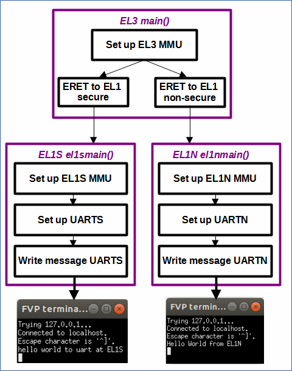
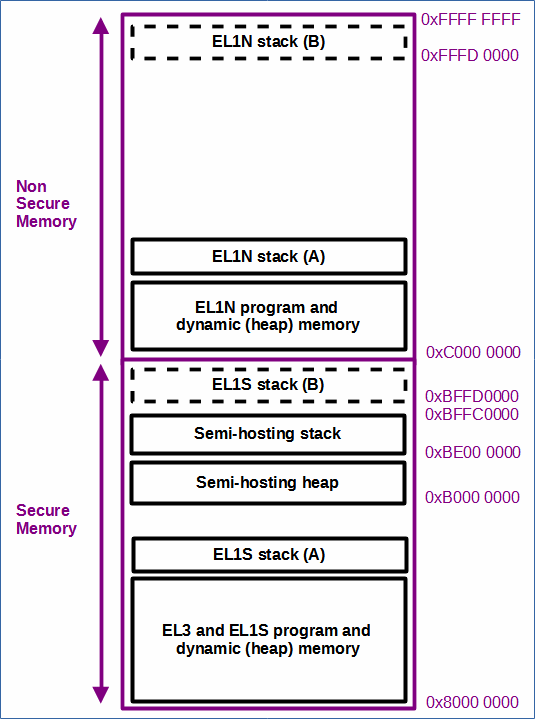

# EL3MMUToEL1MMUUART - Changes Exception level to either EL1S or EL1N and sets up the MMUs and uart, and writes a message. It also sets up secure & non-secure memory regions.

 [Go back to Morello Getting Started Guide.](./../../../../morello-getting-started.md)

## Overview of EL3MMUToEL1MMUUART

This example sets up a LLVM-LD linker script to define secure and non-secure regions of memory in which to load the secure and non-secure software. The example code sets up the MMU in EL3, changes the exception level from EL3 to either EL1 secure (and sets up the MMU mapping of secure memory region and device memory, and a secure version of the UART) or EL1 non-secure (and sets up the MMU mapping of non secure memory region and device memory).

## Program Structure




## Files

The files consist of the following

* EL3entry.c - main c code main() at EL3
* EL1Sentry.c - main c code el1smain() at EL1S
* EL1Nentry.c - main c code el1nmain() at EL1N
* regForEL1N.s - set up of registers and ERET to EL1N
* regForEL1S.s - set up of registers and ERET to EL1S
* el3mmusetup.s - MMU setup for EL3
* el1smmusetup.s - MMU setup for EL1 secure
* el1nmmusetup.s - MMU setup for EL1 non secure
* uartS.c - secure uart functions
* uartS.h - secure uart header file
* uartN.c - non secure uart functions
* uartN.h - non secure uart header file
* linker-script.ld - linker script

## Linker script and Specifying Memory Regions

The linker script specifies two program memory regions within DRAM0 which is 2GB in size.
*  0x80000000 - 1GB secure
*  0xC0000000 - 1GB non secure

Program code is assigned to each region, together with seperate stacks for EL1S and EL1N. The stacks are placed after the program code (A), but the linker script includes provision for the stacks to be optionally placed at the top of the memory regions (B). Defining them at the top increases the size of the ELF file and the time in which it takes to load it into the dissasembler. The semi-hosting heap and stack is confined to secure memory, so that it does not interfer with normal world code placed in the non-secure memory region. Note that the location of the semi-hosting heap and stack is specified in the FVP model run script, and not the linker as follows:

```
-C css.cluster0.cpu0.semihosting-heap_base=0xB0000000
-C css.cluster0.cpu0.semihosting-heap_limit=0xBE000000
-C css.cluster0.cpu0.semihosting-stack_limit=0xBE000000
-C css.cluster0.cpu0.semihosting-stack_base=0xBFFC0000
```



## MMUs set up

The MMUs are set up as follows:
* EL3MMU
    *  0x00000000 - 1GB device memory
    *  0x40000000 - 1GB device memory
    *  0x80000000 - 1GB program memory
    *  0xC0000000 - 1GB program memory
* EL1SMMU
    *  0x00000000 - 1GB device memory
    *  0x40000000 - 1GB device memory
    *  0x80000000 - 1GB program memory
    *  0xC0000000 - 1GB invalid
* EL1NMMU
    *  0x00000000 - 1GB device memory
    *  0x40000000 - 1GB device memory
    *  0x80000000 - 1GB invalid
    *  0xC0000000 - 1GB program memory

see the following for more details about the MMU configuration.

[Understanding the default MMU set up at EL3](./../../DefaultSetup/MMU/MMU.md)

[MMU at EL3 - Setting up the MMU at EL3 for Morello](./../MMUEL3/MMUEL3.md)

## PL011 UART

Documentation and register offsets for the pl011 uart are detailed here:

Technical Reference Manual: https://developer.arm.com/documentation/ddi0183/latest/ 

An ARM example using the pl011 uart (in a different way to used here - the example retargets c functions) can be found here:

https://developer.arm.com/documentation/102440/0100/Retarget-functions-to-use-UART

## Build the Project
First check the linker is pointing to the linker script correctly. Select the project, and right click, then **Properties -> C/C++ Build -> settings -> LLVM C Linker 11.0.0 -> Miscellaneous**.

```
-T/<directory name>/morello-baremetal-examples/developmentStudio/<project name>/src/linker-script.ld -v
```
Then build the project. **Project -> Build Project**

## Connect to the FVP Model
Ensure that you have already launched the FVP model. Double click `<Project>Debug.Launch` and then select `Debug`. The Debugger should connect to the target. 

## Run the Code
In the **Debug Control** window, Either run or step through the code. A message will appear in the console from EL3, and in the UART.

To stop the software and FVP, firstly disconnect the target from within Development Studio, and then type `CTRL+C` in the console from which the FVP was launched.