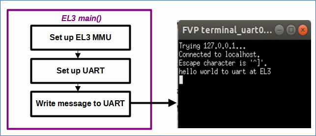

# EL3MMUUART - Changes the MMU set up at EL3 for Morello, sets up the UART and writes a message.

 [Go back to Morello Getting Started Guide.](./../../../../morello-getting-started.md)

## Overview of EL3MMUUART

This example code sets up the MMU and the UART in EL3. The UART is accessed using memory mapped registers. The code writes a message to a uart terminal window.

## Program Structure



## Files

The files consist of the following

* EL3MMUuart.c - main c code main() at EL3
* el3mmusetup.s - MMU setup for EL3
* uartS.c - uart functions
* uartS.h - uart header file
* linker-script.ld - linker script

## Linker script and Specifying Memory Regions

The linker script specifies two program memory regions within DRAM0 which is 2GB in size. The non secure memory is not used in this example.
*  0x80000000 - 1GB secure
*  0xC0000000 - 1GB non secure


## MMU set up

The MMU is set up as follows:
* EL3MMU
    *  0x00000000 - 1GB device memory - UART base address 0x1C090000
    *  0x40000000 - 1GB device memory
    *  0x80000000 - 1GB program memory
    *  0xC0000000 - 1GB program memory


## PL011 UART

Documentation and register offsets for the pl011 uart are detailed here:

Technical Reference Manual: https://developer.arm.com/documentation/ddi0183/latest/ 

An ARM example using the pl011 uart (in a different way to used here - the example retargets c functions) can be found here:

https://developer.arm.com/documentation/102440/0100/Retarget-functions-to-use-UART

## Build the Project
First check the linker is pointing to the linker script correctly. Select the project, and right click, then **Properties -> C/C++ Build -> settings -> LLVM C Linker 11.0.0 -> Miscellaneous**.

```
-T/<directory name>/morello-baremetal-examples/developmentStudio/<project name>/src/linker-script.ld -v
```
Then build the project. **Project -> Build Project**

## Connect to the FVP Model
Ensure that you have already launched the FVP model. Double click `<Project>Debug.Launch` and then select `Debug`. The Debugger should connect to the target. 

## Run the Code
In the **Debug Control** window, Either run or step through the code. A message will appear in the console from EL3, and in the UART.

To stop the software and FVP, firstly disconnect the target from within Development Studio, and then type `CTRL+C` in the console from which the FVP was launched.