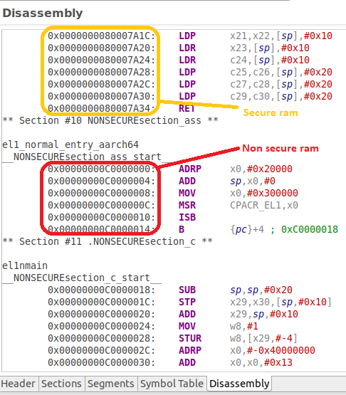

# EL3ToEL1 - Changing Exception Level from EL3 to Either EL1 Secure or EL1 Non-secure

 [Go back to Morello Getting Started Guide.](./../../../../morello-getting-started.md)

## Overview of EL3ToEL1
This example sets up a LLVM-LD linker script to define secure and non-secure regions of memory in which to load the secure and non-secure software. The example can either ERET to EL1 secure, or ERET to EL1 non-secure. This can be changed by modifying the EL3 code.

**Limitations:** 

Because this code is performed after the initialisation sequence, and from `main()` ([Understanding the default initialisation sequence for Morello.](./../../../../morello/BareMetalOnMorello/DefaultSetup/InitSequence/InitSequence.md)), the C library functions are stored in the same memory region as the secure code at EL3. This means that after an ERET to the normal world, although the normal world code is stored in non-secure memory, any C function calls will jump to a secure memory location.

If it is required that bare metal code to be run in the normal world using C functions it would be better to ERET to EL1N during the initalisation sequence, so that the C libraries are stored in non-secure memory. This would require a new initialisation sequence to be written, with a new image entry point.

In the Morello set up, normal world code can be loaded as part of the boot load sequence at BL33 and is compiled as a seperate executable.


## Linker Script and Specifying Memory Regions

The linker script specifies two memory regions within DRAM0 which is 2GB in size.
*  0x80000000 - 1GB secure
*  0xC0000000 - 1GB non secure

Program code is assigned to each region, together with seperate stacks for EL1S and EL1N.

Further information and examples of linker scripts for the LLVM-LD Linker can be found here:

https://www.math.utah.edu/docs/info/ld_3.html 

https://blog.thea.codes/the-most-thoroughly-commented-linker-script/

https://interrupt.memfault.com/blog/how-to-write-linker-scripts-for-firmware


## Files

The files consist of the following

* EL3entry.c - main c code main() at EL3
* EL1Sentry.c - main c code el1smain() at EL1S
* EL1Nentry.c - main c code el1nmain() at EL1N
* regForEL1N.s - set up of registers and ERET to EL1N
* regForEL1S.s - set up of registers and ERET to EL1S
* linker-script.ld - linker script

## Build the Project
First check the linker is pointing to the linker script correctly. Select the `EL3ToEL1` project, and right click, then **Properties -> C/C++ Build -> settings -> LLVM C Linker 11.0.0 -> Miscellaneous**.

```
-T/<directory name>/morello-baremetal-examples/developmentStudio/EL3ToEL1/src/linker-script.ld -v
```
Look at the code in the EL3entry.c file and modify as necessary to perform either an ERET to EL1S or an ERET to EL1N. Then build the project. **Project -> Build Project**

## Check Where in Memory the Program Code will be Loaded

To check where the different parts of the program has been loaded in memory, open the ELF EL3ToEL1.axf file found under **Debug -> src**. Drag the file into the window to open. Here you can inspect the header, sections, and disassembly. 



## Connect to the FVP Model
Ensure that you have already launched the FVP model. Double click `EL3ToEL1Debug.Launch` and then select `Debug`. The Debugger should connect to the target. 

## Run the Code
In the **Debug Control** window, Either run or step through the code. A message will appear in the console to indicate whether an ERET to EL1 secure or EL1 normal world has occured.

To stop the software and FVP, firstly disconnect the target from within Development Studio, and then type `CTRL+C` in the console from which the FVP was launched.