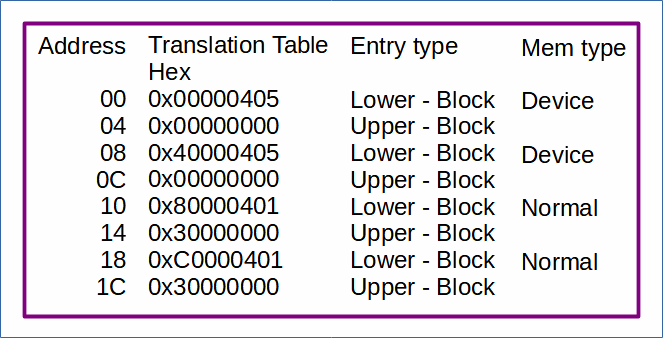
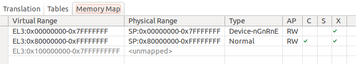
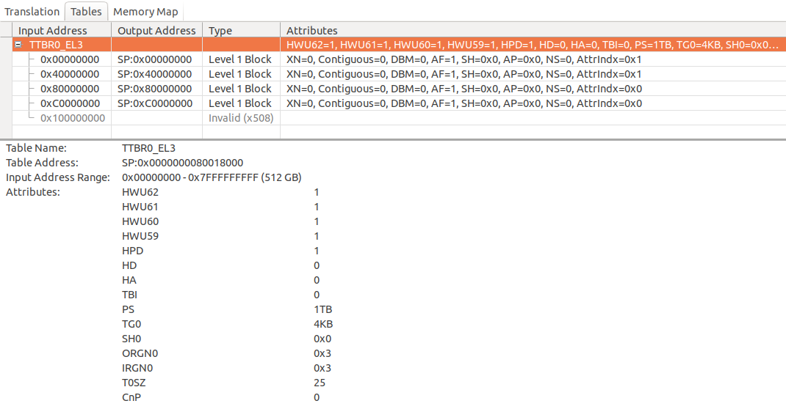

# MMU at EL3 - Setting up the MMU at EL3 for Morello

 [Go back to Morello Getting Started Guide.](./../../../../morello-getting-started.md)

## Overview of MMU at EL3
This example changes the MMU translation table at EL3 to access memory mapped peripherals. This code runs at EL3.
 
The MMU is the memory management unit and controls the translation between virtual and physical memory regions. A translation table, together with a number of registers is required at each exception level to instruct the MMU on how to translate the different regions. See the [default MMU set up for Morello](./../../DefaultSetup/MMU/MMU.md) for more information.

## Translation Table Format

The translation table is based upon the default Morello setup. Although access to the default source code is not possible, the assembly instructions can be viewed by dissassembly in the Development Studio. The translation table has been modified to include peripheral memory regions. The translation table is shown.

The Morello translation table uses a 4KB granule in a level 1 table, assigning memory regions in 1GB blocks. (smaller blocks can be assigned, but the translation table becomes more complex) Thus the memory regions are:
* 0x00000000 to 0x3FFFFFFF - 1GB - device memory, peripherals and memory mapped registers
* 0x40000000 to 0x7FFFFFFF - 1GB - device memory, peripherals and memory mapped registers
* 0x80000000 to 0xBFFFFFFF - 1GB - normal memory, SDRAM0
* 0xC0000000 to 0xFFFFFFFF - 1GB - normal memory, SDRAM0

## Registers

A Number of registers are used to store information relating to the translation table.

### MAIR_EL3 - Memory Attribute Indirection Register (EL3)
This register defines a set of memory types, known as attributes, (e.g normal or device memory) used by the translation table. 

In the example code, an extra device memory (0x00 - Device-nGnRnE) region is specified, and therefore the MAIR attributes are set as:

|Attr7|Attr6|Attr5|Attr4|Attr3|Attr2|**0x00**|**0xEE**|

### TTBR0_EL3 - Translation Table Base Register 0, EL3

The TTBR0_EL3 holds the base address of the translation table for the stage 1 translation.

### TCR_EL3, Translation Control Register (EL3)

The TCR_EL3 is the control register for stage 1 of the translation. The default for Morello is 0x9F820F19, and this example uses the same values.

### SCTLR_EL3, System Control Register (EL3)

The SCTLR_EL3 is the system control register for EL3. **To Enable the MMU, bit 0 needs to be set to 1**. The default value for this register for Morello is  0x30C5183D, and the same value is used in this example.

## Build the Project
Select the `MMUEL3` project, then **Project -> Build Project**

## Connect to the FVP Model
Ensure that you have already launched the FVP model. Double click `MMUEL3Debug.Launch` and then select `Debug`. The Debugger should connect to the target. 

## Run the Code
In the **Debug Control** window, Either run or step through the code. Check the MMU/MP window to check the translation has worked. A message will appear in the console to indicate the mmu was changed.

To stop the software and FVP, firstly disconnect the target from within Development Studio, and then type `CTRL+C` in the console from which the FVP was launched.