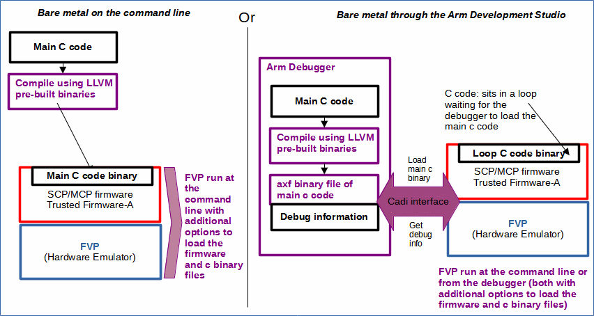

# Bare metal build options

 [Go back to Morello Getting Started Guide.](./../../../morello-getting-started.md)

 ## Overview

Two approaches are detailed here for running bare metal code. The first approach is to run the application binary by loading it directly into the FVP when the FVP is run from the command line. The second approach is to run a loop back code by loading it directly into the FVP, and then using the Arm Debugger to load the main application which can be stepped through to observe and test the code and registers. The first approach is named here as *bare metal on the command line*, and the second approach is named as *bare metal through the Arm Development Studio.*

## Firmware

For both approaches the minimum firmware required is the SCP/MCP and the Trusted Firmware-A. This amounts to the following files, where the `scp_fw.bin` encompasses both the scp ram firmware and the trusted firmware.

`scp_romfw.elf, mcp_romfw.elf, scp_fw.bin`

or

`scp_romfw.bin, mcp_romfw.bin, scp_fw.bin`

The bare metal examples that come with the Arm debugger suggest to use `.elf` files for the `rom` firmware, but `.bin` files can also be used; they are just loaded slightly differently into the FVP on the command line. You may also include the `mcp_fw.bin` file. Although this file is not strictly necessary for the bare metal set up, it is created as part of the build process. When it is *not* loaded into the FVP a `[FIP] Invalid FIP ToC header name:[0xE7FF0010]` is generated in the `FVP terminal_uart0` terminal window. However, it does not effect the running of the bare metal examples. Since the provided bare metal examples do not specify how to generate the firmware files, it is recommended to follow this guide for the specific Morello set up.

## Modification to the SCP source code

For both approaches modification to the SCP source code is required to change the value at which the application processor (AP) resets.

## Compiling application code

To compile the application code for Morello, the pre-built LLVM binaries supporting Morello are required. These can be cloned from the morello git repository.

## Loop C code binary

For the *bare metal through the Arm Development Studio* approach an extra `bts.bin` file is required to sit the FVP in a loop at a specific AP reset address, waiting for the debugger to load the main application. This `bts.bin` file is supplied when importing examples into the Development Studio.