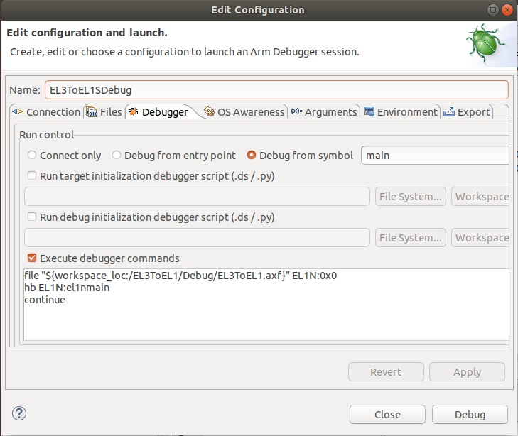

# Important information for writing programs for Morello - things that might catch you out

 [Go back to Morello Getting Started Guide.](./../../../../morello-getting-started.md)

This Document provides details of important things to consider when writing bare metal programs for Morello. This document is a work in progress and will be added to as more important things are discovered. 

## Enabling Morello Instructions

You need to unset a bit in an EL2 register in order to be able to use the Morello instructions beyond EL3 without being trapped. Even when you are not compiling for capability mode, under some circumstances, such as the printf funtion, the capability registers will still be used and if you do not unset this bit your program may terminate due to an exception. The **enable morello instructions** bit is turned off by default (set to 1) in the `_start` code. Note that this is a reserved bit in the armv8a base version so it is not obvious that this bit needs checking.  It is important to note that when this bit is set it traps execution at EL2, EL1, or EL0 of Morello instructions and system registers to EL2.

* CPTR_EL2 - TC, bit [9] when set to 1 traps morello instructions like using capability registers which the printf function uses.

See for more details: https://community.arm.com/developer/research/morello/f/forum/51278/are-capability-registers-used-when-compiling-for-normal-morello-without-pure-capability-with-llvm

**Example code**

```
  // disable trapping of floating point reg q0 - needed for long strings
  // disable trapping of morello specific instructions (uses a reserved armv8 bit) - needed for printf function
  // TFP, bit [10] when set to 1 Traps execution of EL2 instructions which access the Advanced SIMD and floating-point functionality,
  // TC, bit [9] when set to 1 traps morello instructions at EL2/EL1/EL0 like using capability registers which printf function uses
  MRS      x0, CPTR_EL2  // Read
  // create mask 1111 1001 1111 1111
  MOV x2, #0xF9FF
  MOVK x2, #0xFFFF,LSL #16
  // and mask with contents of register to set bit[10] and bit[9] to zero
  AND      x0, x0, x2 // disable
  MSR      CPTR_EL2, x0 // Write
  ISB
```

Other **Morello instruction bits** to check:

* CPACR_EL1.CEN bits[19:18] - traps Morello instructions at EL1/0 to EL1.
* CPTR_EL2.CEN bits[19:18] - when a host operating system is implemented, traps Morello instructions at EL2/1/0 to EL2.
* CPTR_EL3.EC bit[9] - traps all Morello instructions at all ELs and security states to EL3. This trap is cleared by default in the start up code `_start`. See [Understanding the default initialisation sequence for Morello.](./../InitSequence/InitSequence.md)


## Writing assembly for pure capability using LLVM

When writing assembly for *Morello-purecap*, using **LLVM**, enclose pure capability instructions under `__CHERI_PURE_CAPABILITY__` to enable the preprocessor to compile the correct sections of code. 

For automatic preprocessing by the **LLVM compiler** the assembly file **must have** an **uppercase** `S` extension.

The LLVM build settings need to be set. See [Settings needed when compiling for Morello, Morello-purecap, or armv8.2](./../../BareMetalExamples/Compiling/Compiling)

**Example code**

```
#ifdef __CHERI_PURE_CAPABILITY__
  my morello-purecap only code
  ...
#else
  my morello only code
  ...
#endif
my general code for morello and morello-purecap
...
```

## Setting c64 mode for a capability exception

In *Morello-purecap* mode, you need to manually set the c64 state for an exception entry at each EL, otherwise it will be set to a64 by default. Symptoms of the problem include tag bits being cleared such as on the stack pointer after an exception, and the PSTATE.c64 bit set to 0.

* For an exception entry to EL1: CCTLR_EL1.C64E bit[5]
* For an exception entry to EL2: CCTLR_EL2.C64E bit[5]
* For an exception entry to EL3: CCTLR_EL3.C64E bit[5]

**Example code for EL2**

```
  #ifdef __CHERI_PURE_CAPABILITY__
    MRS  x1,  CCTLR_EL2 //read
    // Need to manually set c64 mode for an exception entry, otherwise will be set to a64
    ORR x1,x1, #(1 << 5)
    MSR  CCTLR_EL2, x1 //write
    ISB
  #endif
```

## Setting c64 mode on an ERET

In *Morello-purecap* mode, when performing an ERET you need to manually set the c64 state, otherwise it will be set to a64 by default. Symptoms of the problem include tag bits being cleared on function calls after an ERET, and causing an exception.

* For an ERET from EL3: SPSR_EL3.C64 bit[26]

**Example code**

```
  // set the program state when the exception completes
  LDR	   x1, =PS0_EL1N //the program state
  #ifdef __CHERI_PURE_CAPABILITY__
    // Need to manually set c64 mode on an ERET, otherwise will be set to a64
    ORR x1,x1, #(1 << 26)
  #endif
  MSR      SPSR_EL3, x1
  ISB  

  ERET
```

## Setting c64 mode after some assembly branch instructions 
In *Morello-purecap* mode, some branch instructions default back to a64 mode on the branch. To maintain capability mode the least significant bit of the target capability needs to be set to 1. Symptoms of the problem include an exception occuring on a capability load or store instruction after the branch. Check `PSTATE.c64` after the branch as this will indicate if the state has changed. You can also use the instruction `BX#4` to change the state after the branch, but note this only flips the state from the current state, and you will need to do the same after the return.

## Using malloc() and other heap usage in Morello-purecap with Development Studio

When using the heap in *Morello-purecap* mode with the debugger, make sure the **FVP runscript semi-hosting heap** covers the heap space needed by the program. If this is not set up correctly the `_sbrk()` function used by `malloc()` will return -1, resulting in a **non valid capability**. The heap base needs to be set to an address smaller than the program code end address, as that is where the heap starts. 

```
-C css.cluster0.cpu0.semihosting-heap_base=0x80000000
```
In normal *Morello* mode there are differences in how the heap is calculated and therefore differences between the semihosting and actual heap may not present an issue.

## Debugging at different ELs with Development Studio

You can debug and step through C(++) code at different ELs with Development Studio by adding some extra debugger commands. Without these commands, the symbols and variables are lost after an ERET from EL3 and the debugger reverts to stepping through assembly only. To debug C(++) code at EL1N for example *double-click* on the debug `.launch` file and select the **Debugger** tab. *Tick* the **Execute debugger commands** box and include the additional commands as per example shown below to debug at EL1N. Include the name of the function you wish to start debugging from. In this example it is `el1nmain`.

