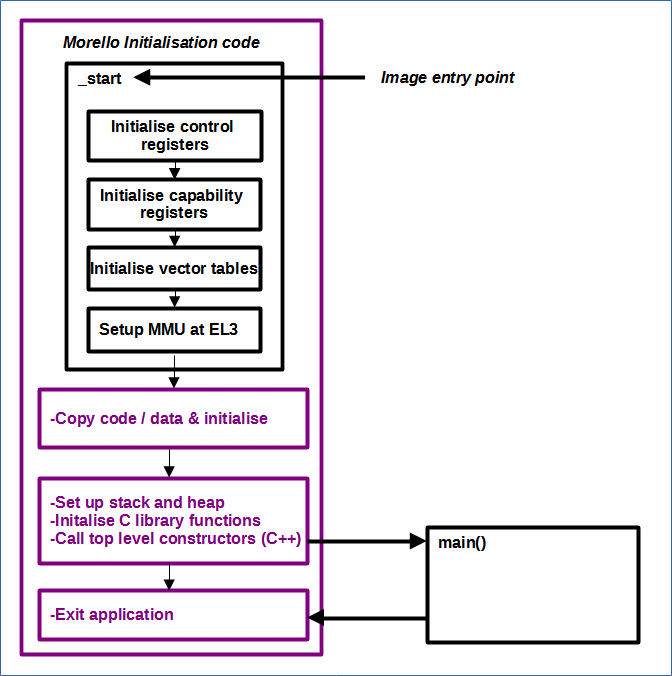

# Understanding the Default Initialisation Sequence for Morello

 [Go back to Morello Getting Started Guide.](./../../../../morello-getting-started.md)

This Document provides an overview of the default initialisation sequence for Morello.

## Initialisation
To prepare the Morello platform (and any embedded system), some initialisation is required before the main program code can be run. This typically consists of initialising code and data and any c library functions used by the program. It also calls any top-level C++ constructors. 

The LLVM LD Linker needs to know the name of the initialisation function. This is called the **image entry point**. The default entry point for the Morello Platform is called `_start` and is integrated into the pre-compiled set of binary files for the LLVM bare metal set up.

When the Program runs on the Morello Platform, both the Morello initialisation and the c library initialisation code will run before main() as shown in the diagram. The `_start` function also handles the exit after the return from main.

For the Morello Platform some specific initialisation code is included such as the set up of control registers for each EL (Exception Level), initialisation of capability registers, vector tables for each EL, and the MMU (Memory Management Unit) for EL3.

## Morello Initialisation Code

### Initialise Control Registers
The following control registers are initialised by default:
* **CPACR_EL1** - Architectural Feature Access Control Register. Controls access to trace, SVE, Advanced SIMD and floating-point, and the Morello architecture.
* **CPTR_EL3** - Architectural Feature Trap Register (EL3). Controls trapping to EL3 of access to CPACR_EL1, CPTR_EL2, also trapping and EL3 access to trace functionality, SVE, Advanced SIMD and floating-point functionality, and to the Morello architecture.
* **CPTR_EL2** - Architectural Feature Trap Register (EL2). Controls trapping to EL2 of access to CPACR, CPACR_EL1, and trapping and EL2 access trace functionality, SVE, Advanced SIMD and floating-point functionality, and to the Morello architecture.
* **SCTLR_EL1** - System Control Register (EL1). Provides top level control of the system, including its memory system, at EL1 and EL0.
* **SCTLR_EL2** - System Control Register (EL2). Provides top level control of the system, including its memory system, at EL2.
* **SCTLR_EL3** - System Control Register (EL3). Provides top level control of the system, including its memory system, at EL3.

### Initialise Capability Registers
Capability registers are initialised.

### Initialise Vector Tables

When an exception occurs, the processor executes handler code to deal with the exception. The location in memory where the handler is stored is called the exception vector. Exception vectors are stored in a table of a fixed format. There is one table for each exception level. The following vector tables are initialised by default:

* **VBAR_EL3** Vector Base Address Register. Holds the vector base address for any exception that is taken to EL3.
* **VBAR_EL2** Vector Base Address Register. Holds the vector base address for any exception that is taken to EL2.
* **VBAR_EL1** Vector Base Address Register. Holds the vector base address for any exception that is taken to EL1.
* **CVBAR_EL3** *Capability* Vector Base Address Register. Holds the vector base address for any exception that is taken to EL3.
* **CVBAR_EL2** *Capability* Vector Base Address Register. Holds the vector base address for any exception that is taken to EL2.
* **CVBAR_EL1** *Capability* Vector Base Address Register. Holds the vector base address for any exception that is taken to EL1.

### Setup the MMU at EL3
The MMU is initialised at EL3 for DRAM0 by default. The set up is for flat mapping, meaning that there is a direct translation between virtual and physical address. The mapping is split into two blocks:
* 0x80000000 - 1GBytes
* 0xC0000000 - 1GBytes

The TTBR0_EL3 register specifies the translation.

See [Understanding the default MMU set up at EL3](./../MMU/MMU.md) for a more detailed look at the default MMU set up

## Making Changes to the Default set up
With the default set up, it is assumed that any bare metal code will be written at EL3 in C/C++, and is only using the DRAM0 memory region. If you wish to make changes to the default set up, then there are a number of options available:

1. Depending on what you need to change, it may be possible to make the necessary changes after the default code has run. The bare metal set up starts in EL3 where you are at the highest privilege level and have the ability to access all memory areas and registers. For example it is possible to change the translation table configuration of the MMU within `main()` to access other memory regions such as peripherals.

2. It is also possible to write your own startup function from scratch and change the **image entry point** to point to your new function. For example if you would like to change your bare metal code to run in the normal world at EL1, then you could change the initialisation code such that  EL3 and EL1 registers are initialised, and then an ERET to EL1 is performed before entering `main()`. The downside of this setup though is that you would need to ensure that the c libraries and your linker scripts are set up correctly which could be time consuming if no examples or templates are available.

3. If you are writing pure assembly code you do not need to set up the c libraries, but you would need to take care of setting up the stack and heap correctly and writing all of the necessary functions yourself. You would additionally need to configure the linker scripts with the correct memory set up. This could be time consuming if no examples or templates are available. You would also need to change the **image entry point** to point to your new start function.

## Further information
A good place to start for further general information about embedded start up sequences can be found here:
https://embeddedartistry.com/blog/2019/04/08/a-general-overview-of-what-happens-before-main/ 

