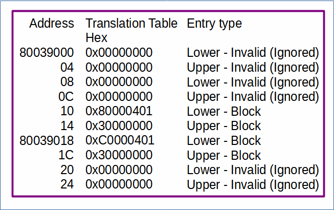
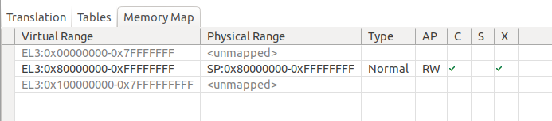
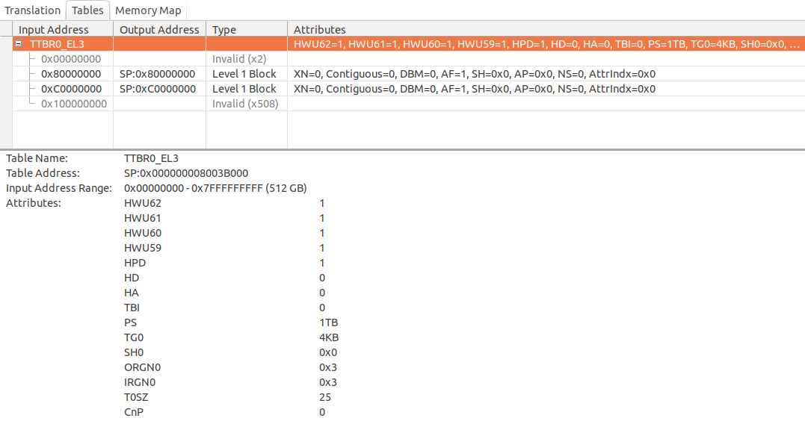

# Understanding the default MMU set up at EL3

 [Go back to Morello Getting Started Guide.](./../../../../morello-getting-started.md)

The MMU is the memory management unit and controls the translation between virtual and physical memory regions. A translation table, together with a number of registers is required at each exception level to instruct the MMU on how to translate the different regions. For the Morello bare metal set up, a translation table for EL3 is defined within the default initialisation sequence.

A good introduction to memory management can be found here: https://developer.arm.com/documentation/101811/0101/What-is-memory-management

## Translation Table Format

Translation tables are stored in memory as 64 bit entries split into two lots of 32 bits (lower, and upper). Each entry can be one of three types: Invalid (entry ignored), Block (defines memory region), or Table (address/properties of next table). See https://armv8-ref.codingbelief.com/en/chapter_d4/d43_1_vmsav8-64_translation_table_descriptor_formats.html 

## Morello Translation Table

The default translation table for Morello only uses Invalid and Block type entries as shown in the diagram. Bit[0] of each 64 bit entry determines if the entry is valid, if the entry is not valid, it is ignored. If the entry is valid, bit[1] determines if it is either a Block entry or a Table entry. 

The Morello translation table uses a 4KByte granule (bits 14 and 15 in the TCR_EL3 register set to 0) in a level 1 table.  This is apparent from studying the translation table in memory because in this configuration, mapping appears in 1GB blocks. The first two entries are not used (Invalid) but would probably correspond to memory regions 0x0 to 0x3FFFFFFF (1Gbyte), and 0x40000000 to 7FFFFFFF (1Gbyte). The first valid entry begins at 0x800000000 at the start of the DRAM0, and the third GB block. The next 1GB entry begins at 0xC0000000, which is half way along the DRAM0 memory.

The format for a block entry (4KByte granule size level 1 table) is as follows:

|Upper Block Attributes|Res0|Output Address [47:30]|Res0|Lower Block Attributes|0|1|

For the first valid entry (0x30000000 80000401) this would correspond to:

|0011 0000 0000|0000|0000 0000 0000 0000 10|00 0000 00000 0000|0000|0100 0000 00|0|1|

The first three bits of the **Lower Block Attributes (bit[4:2])** determine the type of memory such as device or normal, and is an index pointing to the attribute specified within the MAIR register. The Morello entry is pointing to the first MAIR attribute (see register below). Bit[5] is the Non-secure bit. For memory accesses from Secure state, it specifies whether the output address is in the Secure or Non-secure address map. Bit[11] is also set which is the AF access flag. Within the Upper block attributes bit[61:60] are also set which are hardware implementation defined since bits 25 to 28 are set in the TCR_EL3 register. See https://armv8-ref.codingbelief.com/en/chapter_d4/d43_3_memory_attribute_fields_in_the_vmsav8-64_translation_table_formats_descriptors.html#

## Registers

A Number of registers are used to store information relating to the translation table.

### MAIR_EL3 - Memory Attribute Indirection Register (EL3)
This register defines a set of memory types, known as attributes, (e.g normal or device memory) used by the translation table. The purpose is to specify the type of memory for each region mapped by the MMU. Instead of the translation table holding this information directly, it indexes to a specific attribute within the MAIR register. Each attribute is 8 bits (2 bytes) and up to 8 attributes can be defined.

|Attr7|Attr6|Attr5|Attr4|Attr3|Attr2|Atrr1|Attr0|

Each of the MAIR Attributes can be set as one of the following:
* **Device Memory:**
    * hex:0x00  bin:0000 0000   - Device-nGnRnE
    * hex:0x04  bin:0000 0100   - Device-nGnRE
    * hex:0x08  bin:0000 1000   - Device-nGRE
    * hex:0x0C  bin:0000 1100   - Device-GRE
* **Normal Memory:**
    * First byte:
        * hex:0x0               bin:0000     - ?
        * hex:0x1, 0x2, 0x3     bin:00RW     - Outer write through transient
        * hex:0x4               bin:0100     - Outer non-cacheable
        * hex:0x5, 0x6, 0x7     bin:01RW     - Outer write back transient
        * hex:0x9, 0xA, 0xB     bin:10RW     - Outer write through non-transient
        * hex:0xD, **0xE**, 0xF     bin:11RW     **- Outer write back non-transient**
    * Second byte:
        * hex:0x0               bin:0000     - ?
        * hex:0x1, 0x2, 0x3     bin:00RW     - Inner write through transient
        * hex:0x4               bin:0100     - Inner non-cacheable
        * hex:0x5, 0x6, 0x7     bin:01RW     - Inner write back transient
        * hex:0x9, 0xA, 0xB     bin:10RW     - Inner write through non-transient
        * hex:0xD, **0xE**, 0xF     bin:11RW     **- Inner write back non-transient**

The default attributes for Morello at EL3 are shown as highlighted above and specified below for clarity. Only a normal memory attribute is defined, and this is applied to the DRAM0 region.

|Attr7|Attr6|Attr5|Attr4|Attr3|Attr2|Attr1|**0xEE**|

### TTBR0_EL3 - Translation Table Base Register 0, EL3

The TTBR0_EL3 holds the base address of the translation table for the stage 1 translation.

### TCR_EL3, Translation Control Register (EL3)

The TCR_EL3 is the control register for stage 1 of the translation. The default for Morello is 0x9F820F19, which is encoded as:

|RES1|TCMA|TBID|HWU62|HWU61|HWU60|HWU59|HPD|RES1|HD|HA|TBI|RES0|PS|TG0|SH0|ORGN0|IRGN0|RES0|T0SZ

|1|0|0|1|1|1|1|1|1|0|0|0|0|010|00|00|11|11|00|011001|

* Bits set:
    * 0,3,4 - The size offset of the memory region addressed by TTBR0_EL3. The region size is 2^(64-T0SZ) bytes, which is 39 bits for Morello (64-25(19hex))
    * 8,9 - Inner cacheability attribute for memory - Walks to TTBR0 are Normal memory, Inner Write-Back Read-Allocate No Write-Allocate Cacheable.
    * 10,11 -  Outer cacheability attribute for memory - Walks to TTBR0 are Normal memory, Outer Write-Back Read-Allocate No Write-Allocate Cacheable.
    * 17 - Physical address size - 40 bits, 1TB.
    * 23 - Reserved
    * 24 - Hierarchical permissions are disabled
    * 25 - Bit[59] of each stage 1 translation table Block or Page entry can be used by hardware for an implementation defined purpose.
    * 26 - Bit[60] of each stage 1 translation table Block or Page entry can be used by hardware for an implementation defined purpose.
    * 27 - Bit[61] of each stage 1 translation table Block or Page entry can be used by hardware for an implementation defined purpose.
    * 28 - Bit[62] of each stage 1 translation table Block or Page entry can be used by hardware for an implementation defined purpose.
    * 31 - All accesses are Unchecked at EL3 when address [59:56] = 0b0000.

    ### SCTLR_EL3, System Control Register (EL3)

    The SCTLR_EL3 is the system control register for EL3. **To Enable the MMU, bit 0 needs to be set to 1**. To disable the MMU bit 0 needs to be set to 0. The default for Morello after the MMU is set up is  0x30C5183D, which is encoded as:

    |EnIA|EnIB|RES1|EnDA|RES0|EE|RES0|RES1|EIS|IESB|RES0|WXN|RES1|RES0|RES1|RES0|EnDB|I|EOS|RES0|nAA|RES1|SA|C|A|M|

    |0|0|11|0|0|0|0|1|1|0|0|0|1|0|1|00|0|1|1|0000|0|11|1|1|0|1|

    * Bits set:
      * 0 - **Enable MMU**
      * 2 - Alignment fault checking enabled
      * 3 - SP Alignment check enabled
      * 4,5 - Reserved
      * 11 - An exception return from EL3 is a context synchronizing event.
      * 12 - This control has no effect on the Cacheability of instruction access to Normal memory from EL3.
      * 16 - Reserved
      * 18 - Reserved
      * 22 - The taking of an exception to EL3 is a context synchronizing event.
      * 23 - Reserved
      * 28,29 - Reserved

      ## What the Mapping looks like in the Development Studio

      
      