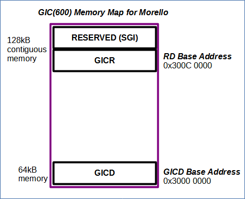

# Understanding the Morello Memory Map.

 [Go back to Morello Getting Started Guide.](./../../../../morello-getting-started.md)

Documentation outlining Morello's memory maps can be found here: [Arm Morello System Development Platform Preliminary Technical Reference Manual.](./https://developer.arm.com/documentation/102278/latest)

Whilst this provides a general overview, it does not give clear details of the location of some specific devices and their memory mapped registers.

The purpose of this guide is to fill in missing detailed information and is a work-in-progress document that will be added to as necessary for the purposes of this project.


## Memory Types
There are two different types of memory defined: **normal memory** and **device memory**. Normal memory is assigned to areas such as program memory, for example where DRAM is located in the memory map. Device memory is assigned to areas where peripheral devices and their registers are located such as the Interrupt controller and its memory mapped registers. It is important to understand the difference when setting up the MMU translation tables.

## DRAM Program Memory
Bare metal programs are loaded into DRAM0 memory by default, starting at the base address of 0x80000000. The image entry point, where the actual program starts, is usually offset to 0x80011000. This can be seen by observing the **ELF** file (filename.axf). Additionally, the memory management unit (MMU) is initialised at EL3 for DRAM0 by default. The DRAM0 memory range is as follows:

0x80000000 - 0xFFFFFFFF - 2GBytes

It is possible to change the base address at which the program is loaded into memory through a linker command line option. 

```
--image-base 0x80000000
```
In Development Studio select the project you wish to change and right-click. Select **Properties -> C/C++ Build -> Settings -> LLVM C Linker 11.0.0 -> Miscellaneous** and then add the command line to the **-Xlinker** options. After the project is re-built the ELF file should now show the new image entry point address (with the offset).

## General Interupt Controller (GIC-600) Memory Mapped Registers
To use the Interrupt controller there are both system registers and memory mapped registers that need to be accessed. The memory mapped registers are configured as shown in the diagram. There are two regions: the first is located at the GICD base address and uses 64kB of memory space, the second is located at the RD base address and uses 128kB split into two regions of 64kB of contiguous memory space. The Morello Platform uses the GIC-600 version where extra power management of the redistributor is required.



## Access to the PL011 UART
The Morello Platform has access to the standard ARMv8-A PL011 UART. Although not specified in the Morello Documentation, this can be accessed through the base address at 0x1C090000. This is located at the top of the **Expansion AXI** region (0x08000000 - 0x1FFFFFFF).

## More....
More Content to be added.