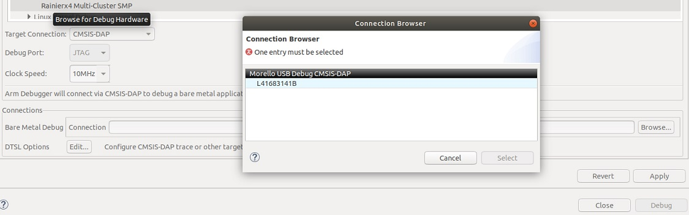
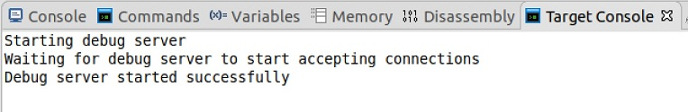

# Morello Hardware: Verifying the embedded debug can connect to Development Studio
 [Go back to Morello Getting Started Guide.](./../../../morello-getting-started.md)

This document describes the process to verify that the embedded debug interface from the Morello hardware to the host machine running Development Studio works correctly. This debug connection is needed for bare metal development on the hardware. This document is written for a host Windows machine, running a VM with Ubuntu 18.04.

The Morello Platform has an embedded debug attached to the USB port. It implements the CMSIS-DAP interface and can be used to connect to the Development Studio debugger software. 

1. Open the VM running Ubuntu and install the **2022.0M0** version (or later) of the ([Morello edition of Development Studio](./../InstallingArmDevStudio/InstallingArmDevStudio.md)). Ensure that during the post-installation process you select yes to install the debug pack SDP for Morello. This is needed to connect to the hardware.

2. Connect the USB cable from the Morello machine to the host computer, and turn on the Morello machine via the switch on the back. If this is the first time the Morello hardware has been turned on follow this first: [Turning on the Morello Hardware Platform for the first time.](./../../MorelloPlatform/SettingUpMorelloSoc.md)

3. Open a **PuTTY** window for each COM port. The COM ports appear in the following order: **Motherboard Configuration Controller(MCC), Platform Controller Chip(PCC), Application Processor(AP), System Control Processor(SCP)**

4. Patch the USB cable to the VM by selecting **Devices -> USB -> Arm Ltd Arm Morello USB Debug[0100]** from the VM file menu. 

5. From Development Studio create a new hardware connection. **File -> New -> Hardware Connection**. Select **Morello SDP** which is the only available option and click **Finish**. Wait for the **Debug Configuration** pane to open.
6. On the **Debugger** tab select **connect only** to test the debug connection.
6. Select the **CMSIS-DAP** as the Target Connection.
7. Click onto the **Browse...** button of the Bare Metal Debug Connection to open the **Connection Browser** and select the only available debug connection.

8. Start the **Debug**.
9. In Development Studio a Target Console is displayed showing a message that the debug server is being started. If successful a message is displayed.

10. To step through the running code, press the Pause button (green || button), and select the **Disassembly View**.
11. To disconnect right-click onto the debug connection and select **Disconnect**.