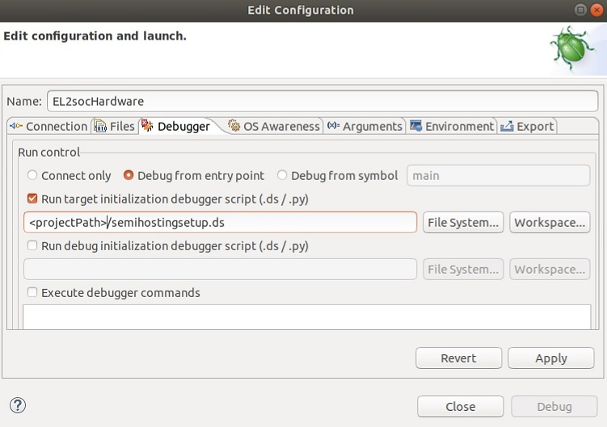

# Morello Hardware: Semihosting on the hardware
 [Go back to Morello Getting Started Guide.](./../../../morello-getting-started.md)


Semihosting is enabled by default on the FVP, but needs to be explicitly enabled when using it on the hardware through Development Studio. First create a file `semihosting.ds` in the project and set up the heap and stack, similar to the settings which can be used on the fvp to overwite the default values. Then you need to enable the semihosting. Type the following into the file:

```
set semihosting heap-base 0
set semihosting heap-limit 0x80800000
set semihosting stack-limit 0x80800000
set semihosting stack-base 0x81000000
set semihosting enabled on
```

These commands need to be run before the program is downloaded and run. To do this you need to edit the hardware connection configuration in Development Studio. Open the **Edit Configuration** box by double-clicking on the hardware `.launch` file. Enter the path of the `semihosting.ds` file under the **Debugger** tab, and check the box for **Run target initialization debugger script** as shown. 



This will set up and enable the semihosting on the hardware.