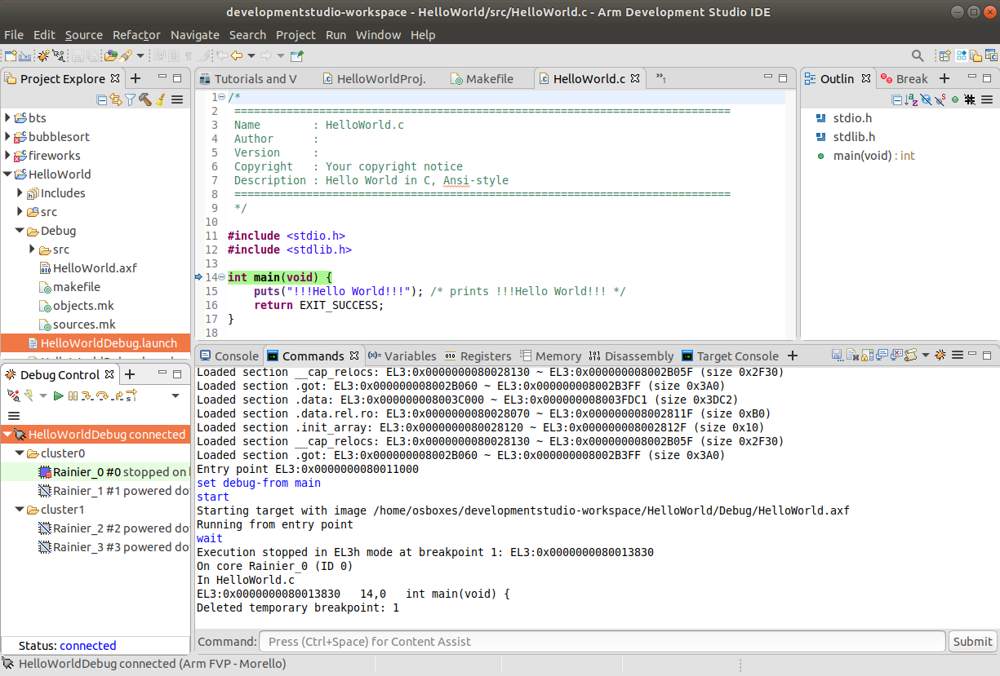
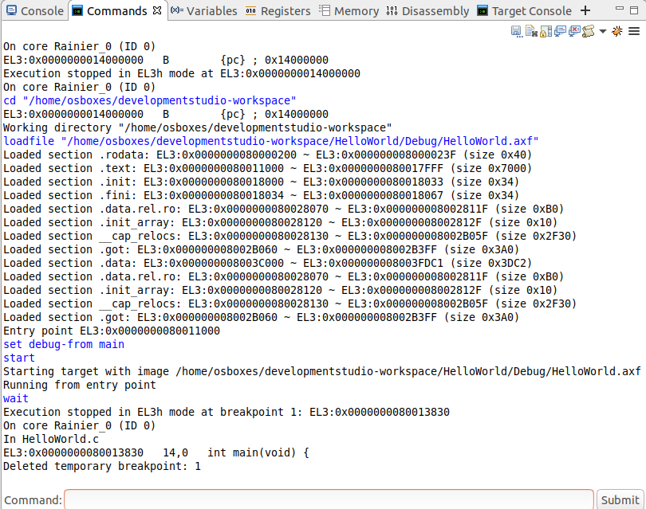
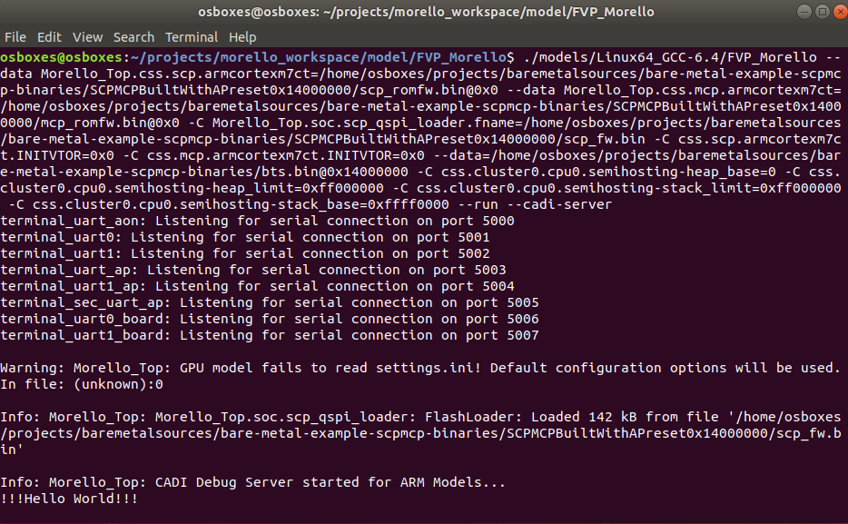
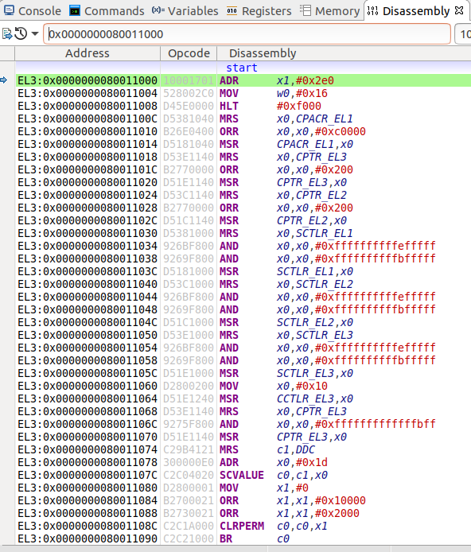
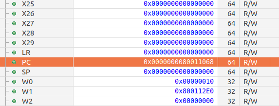
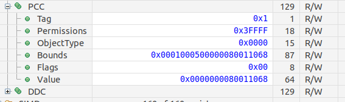

# Creating and running a bare metal "hello world" through the Arm Development Studio
 [Go back to Morello Getting Started Guide.](./../../../morello-getting-started.md)

 ## Overview
 This guide covers
 * Import example bts.bin file
 * Create a new hello world project
 * Configure the toolchain for Morello pure capability
 * Build the project
 * Load the Morello FVP
 * Create a debug session and connect to the Morello FVP
 * Run the hello world application
 * Finish the debug Session
 * Other things to look at - Debug from Entry Point


## Assumptions

* The prebuilt Morello supported LLVM binaries for bare metal have been installed
* The Morello FVP has been installed
* The bare metal firmware has been built with the AP reset at 0x14000000
* The Morello Edition of the Arm Development Studio has been installed

## Supporting Documentation

Further documentation regarding bare metal examples for the Development studio can be found in

* section: *5.14 Examples provided with Arm Development Studio Morello Edition* of the Getting Started Guide https://developer.arm.com/documentation/102233/2020-1m0 

* Section: 8.1 *Tutorial: Hello World* of the Getting Started Guide https://developer.arm.com/documentation/102233/2020-1m0

## Import example bts.bin file

Bare metal code running from the Development Studio requires a *Loop C code binary* loaded into the FVP allowing it to sit in a loop at address 0x14000000 waiting for the main code to be loaded. This binary file can be obtained from the bts example project.

1. Open the Development Studio. In the main menu, select **File > Import**. Under the **Arm Development Studio** select **Examples & Programming Libraries**. The bts example should be listed. Import bts and click **Finish**.

2. The source files for this example is now located under `~/developmentstudio-workspace`. Copy the `bts.bin` file from under the `bts` directory and copy it to `~/projects/baremetalsources/bare-metal-example-scpmcp-binaries/`. This will be used when the Morello FVP is run later.

## Create a new hello world project

1. To create a new project ib the Development Studio, select: **File > New > Project**. Expand the **C/C++** menu, and select **C project**, then click **Next**.

2. In the **C Project** dialog box set the following:

    * In the **Project name** field, enter `HelloWorld`
    * Under **Project type**, select **Executable > Hello World Ansi C Project**.
    * Under **Toolchains**, select **LLVM 11.0.0**
    * Click **Finish**

## Configure the toolchain for Morello pure capability

1. In the **Project Explorer** view, right-click the `HelloWorld` project and select **Properties**. 

2. Select **C/C++ Build > Settings > Tool Settings** tab and set the LLVM toolchain as follows:

* **LLVM C Compiler** options:

    * In **Target**, enter `aarch64-none-elf`
    * In **Architecture**, enter `morello+c64`
    * In **ABI(-mabi)**, enter `purecap`

* **LLVM Assembler** options:

    * In **Target**, enter `aarch64-none-elf`

* **LLVM C Linker** options:

    * In **Target**, enter `aarch64-none-elf`
    * In **Architecture**, enter `morello+c64`
    * In **ABI(-mabi)**, enter `purecap`

3. Click **Apply and Close**. If you are prompted to rebuild the index, click **Yes**.

## Build the project
1. In the **Project Explorer** view, right-click the `HelloWorld` project, and select **Build Project**. The output file `HelloWorld.axf` can be found in the **Project Explorer** view, under **Debug**. This contains both object code and debug symbols. 

## Load the Morello FVP
The Morello FVP now needs to be loaded and prepared ready for it to be connected to the debugger. The cadi interface is used to connect the FVP to the Development Studio debugger and needs to be set as an option on the command line when loading the FVP.

1. Open a new terminal window and navigate to `~/projects/morello_workspace/model/FVP_Morello` directory, and run the command below. If there are errors check that the paths to your binary files are all set correctly.

Things to note from the command line:
* The `bts.bin` is loaded at the AP reset address of 0x14000000.
* The `scp_rom.bin` is loaded into the scp cortexM7 device at 0x0.
* The `mcp_rom.bin` is loaded into the mcp cortexM7 device at 0x0.
* The `--run` option is set. This tells the model to start running the SCP and MCP firmware immediately.
* The `--cadi-server` option is set. This tells the model to launch a CADI server.

```
./models/Linux64_GCC-6.4/FVP_Morello \
--data Morello_Top.css.scp.armcortexm7ct=/home/osboxes/projects/baremetalsources/bare-metal-example-scpmcp-binaries/SCPMCPBuiltWithAPreset0x14000000/scp_romfw.bin@0x0 \
--data Morello_Top.css.mcp.armcortexm7ct=/home/osboxes/projects/baremetalsources/bare-metal-example-scpmcp-binaries/SCPMCPBuiltWithAPreset0x14000000/mcp_romfw.bin@0x0 \
-C Morello_Top.soc.scp_qspi_loader.fname=/home/osboxes/projects/baremetalsources/bare-metal-example-scpmcp-binaries/SCPMCPBuiltWithAPreset0x14000000/scp_fw.bin \
-C css.scp.armcortexm7ct.INITVTOR=0x0 \
-C css.mcp.armcortexm7ct.INITVTOR=0x0 \
--data=/home/osboxes/projects/baremetalsources/bare-metal-example-scpmcp-binaries/bts.bin@0x14000000 \
-C css.cluster0.cpu0.semihosting-heap_base=0 \
-C css.cluster0.cpu0.semihosting-heap_limit=0xff000000 \
-C css.cluster0.cpu0.semihosting-stack_limit=0xff000000 \
-C css.cluster0.cpu0.semihosting-stack_base=0xffff0000
--run 
--cadi-server
```

## Create a debug session and connect to the Morello FVP

1. In the Development Studio, select **File > New > Model Connection**. If **Model Connection** is not displayed select **Other > Arm Debugger > Model Connection** and specify the details of the connection:

* Enter a name, for example `HelloWorldDebug`.
* Select **Associate debug connection with an existing project**, and select the `HelloWorld` project and click **Next**. 

2. Select the target to debug: **Arm FVP > Morello** and click **Finish**.

3. The **Edit Configuration** dialog box is automatically launched ready to connect to the target. Some settings need to be specified first which are then saved and can be used next time you connect.

* In the **Connection** tab, select **Arm FVP > Morello > Bare Metal Debug > Rainierx4 Multi-Cluster SMP**
* In the **Files** tab, select **Target Configuration > Application on host to download > Workspace**. Expand the `HelloWorld` project and from the **Debug** folder, select `HalloWorld.axf` and click *OK*.
* In the **Debugger** tab, select **Debug from symbol**. This allows you to step through the code by symbol, rather than by assembly code.
* Click **Apply**.

4. To load the `HelloWorld` application onto the Morello FVP click **Debug**

## Run the hello world application

This section describes how to run the application and what you should see if it is working correctly.

When you first connect the debugger you should see something like the picture below if it is working correctly. The **HelloWorldDebug** is connected, the entry point arrow is pointing to `int main(void)` and the **Commands** window indicates that the `HelloWorld.axf` file has been loaded and is stopped at `EL3:0x0000000080013830`.



The full **Commands** should be displayed as follows. Note that the loop back code `bts.bin` on core Rainier_0 is displayed as `EL3:0x0000000014000000 B {PC} ; 0x14000000`.



In the **Debug Control** window click the **Step Source Line** icon to step through the code. If the program is working you should see the words **!!!Hello World!!!** appear on the console from which the FVP was launched.



## Finish the debug Session

To stop the debug session, in the **Debug Control** window right-click on **HelloWorldDebug connected** and select **Disconnect from Target**.

To stop the Morello FVP model press **CTRL & C**.

## Other things to look at - Debug from Entry Point

You can also step your code by assembly. You can do this by changing the debug settings to **Debug from entry point** rather than **Debug from symbol**. To do this:

* Re-load the Morello FVP in a terminal window
* In the Development Studio Right-click on **HelloWorldDebug Disconnected** in the **Debug Control** window and select **Debug Configurations**. Under the **Debugger** tab select **Debug from entry point**. Click **Apply** and then **Debug**.

In the **Commands** window the execution has now stopped at `EL3:0x0000000080011000 ADR x1,#0x2e0`. 

* In the **Dissassembly** window type in the address `0x0000000080011000` and you should see the assembly code. You can **Step Source Line** to step through the code.



You can also look at the value of the **registers** and **capability registers** as you step through the code.





