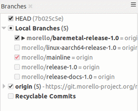

# Getting the prebuilt Morello supported LLVM binaries for bare metal

 [Go back to Morello Getting Started Guide.](./../../../morello-getting-started.md)

 ## Overview

The LLVM toolchain binary files are located under the llvm-project-releases in the morello git repository
https://git.morello-project.org/morello/llvm-project-releases 

These are needed in order to compile application code for bare metal.

Git documentaion regarding the compiler binaries are located here:
https://git.morello-project.org/morello/docs/-/blob/morello/mainline/toolchain-readme.rst 

There is also Arm LLVM toolchain documentation, including a LLVM Toolchain user guide, and the LLVM Bare-metal Toolchain user guide at
https://developer.arm.com/architectures/cpu-architecture/a-profile/morello/development-tools 

## Llvm-project-releases project structure

The llvm-project-releases has several branches. Before cloning the project it is important to understand the structure to ensure the correct branch (release) is checked out for a particular project. As of Feb 2021 the following branches existed
   * morello/mainline - *Mainline code.*
   * morello/release-docs-1.0 - *pdf user guide documents.*
   * `morello/baremetal-release-1.0` - *Bare metal llvm toolchain binaries which can be used stand-a-lone or with the Arm Development Studio.*
   * morello/release-1.0 - *Android llvm toolchain binaries.*
   * morello/linux-aarch64-release-1.0 - *Baremetal llvm toolchain for compiling on the actual morello platform – not yet fully supported Feb 2021.*

It is the `highlighted` baremetal branch that needs to be used for the bare metal examples. It is also important to note that the bare metal branch is disconnected from the mainline and therefore needs to be checked out to ensure the correct toolchain is selected. 

## Cloning the llvm binaries
You will need to clone the project from GitLab `morello/llvm-project-releases` to `projects/baremetalsources/llvm-project-releases`

## Cloning using Smartgit

1. If using Smartgit go to the morello git repository and copy the https clone `https://git.morello-project.org/morello/llvm-project-releases.git`

2. Open a terminal in Ubuntu 18.04 and load SmartGit under `/<path>/smartgit/bin` directory
```
./smartgit.sh
```
3. In SmartGit goto `Repository/clone` and paste in the Remote repository URL above. 

4. After the Repository has been cloned, check out the bare metal branch using log view. This needs to be done to ensure the correct toolchain is selected since the bare metal branch is disconnected from the mainline.



The binary files are located under the `bin/` directory and are ready to be used. [Go back to Morello Getting Started Guide.](./../../../morello-getting-started.md)