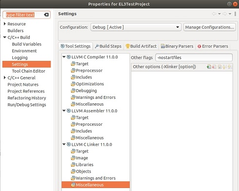

# How to modify the default initialisation files for your project at EL3
 [Go back to Morello Getting Started Guide.](./../../../morello-getting-started.md)

This document describes the process to modify the initialisation files that run before the `main` function. This may be required if you need to add extra boot code or change the MMU set up. See [Understanding the Default Initialisation Sequence for Morello](./../DefaultSetup/InitSequence/InitSequence.md) for more information regarding what happens before `main`. This document assumes the developer is using the Morello edition of Development Studio. See [Installing the Morello edition of the Arm Development Studio](./../InstallingArmDevStudio/InstallingArmDevStudio.md) for more information.

## Obtain a copy of the initialisation files

First, download the initialisation files. Ensure the versions you download match the version of the LLVM baremetal release you are using in Development Studio. For example if you installed `LLVM morello/release-1.3` from the `llvm-project-releases` repository, ensure you download the source files `morello/release-1.3` from the `Newlib` source repository. https://git.morello-project.org/morello/newlib/-/tree/morello/release-1.3

* newlib/libgloss/aarch64/crt0.S *(main _start function)*
* newlib/libgloss/aarch64/svc.h
* newlib/libgloss/aarch64/cpu-init/rdimon-aem-el3.S *(MMU setup and vector table)*

`crt0` contains the main _start function, `svc.h` is referenced by `crt0` and `rdimon-aem-el3.S` contains functions called from within `crt0`. 

## Create a new project in Development Studio

Create a new "Hello World" project in Development Studio. Copy the three files into the src directory. 

## Exclude the default initialisation files from the build

You need to exclude the default initialisation files from the build otherwise there will be errors associated with duplicate symbols. Select the project and **right-click**. Select **Properties -> C/C++ Build -> Settings -> LLVM C Linker 11.0.0 -> Miscellaneous**. In the **Other Flags** box type `-nostartfiles` as shown. This will stop the default initialisation files from being incorporated into the build.



## Create stubs for _init and _fini

If the files are compiled now, an error occurs regarding missing symbols for  `_init` and `_fini`. You can simply create a stub for those. create a c file `initfunc.c` and copy in the following code:
```
void _init (void) {}
void _fini (void) {}
```
## Build the project

Build your project as normal. You may wish to verify that the project still works on the FVP before going further.

## Modify the initialisation files

You are now free to start modifying the initialisation files for your project.