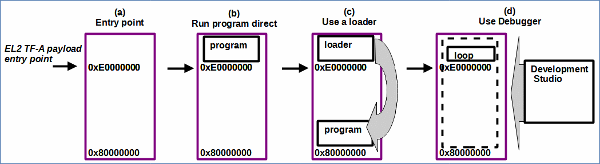

# FVP/Hardware: Create a purecap TF-A baremetal payload running at EL2, with modified initialisation files.

 [Go back to Morello Getting Started Guide.](./../../../morello-getting-started.md)

## Overview

This guide describes how to use the [modified initialisation files](./../Modifycrt0/Modifycrt0ForEL2.md) to run a purecap TF-A payload program running at EL2.

This describes how to:
* Download the program from Development Studio.
* Build a FIP image of the program with a loader from the output of the Development Studio Project (`<project>.axf` elf file).

## TF-A - payload entry point for EL2 bare metal programs

The TF-A payload has a fixed entry point of 0xE0000000 (**See (a) in diag.**). 

A binary image of your program can be loaded and run directly from this entry point (**See (b) in diag.**). This is done by building it into the fip image as BL33. This is OK if your program is small and the MMU etc is set up for it to run in that memory space. A linker script is needed to ensure the first line of code executes at the entry point. (See [FVP/Hardware: Create a TF-A baremetal payload running at EL2](./TFApayload.md). It may be difficult to ensure everything is set up correctly to run from this address.

However if your program is required to be run from the start of SDRAM at 0x80000000, you can package your program into a loader before building it into the fip image (**See (c) in diag.**). The loader runs at the 0xE0000000 entry point to load the program at the desired address. This only works if your program does not overwite the loader during the loading process, and fits within the available memory space. You may not need to write a linker script if the default one is adequate for the needs of the program.

Alternatively you can download your program from the debugger (Development Studio) where the program can be loaded into all of the SDRAM memory as required. A loop program is initially loaded as the TF-A payload (**See (d) in diag.**). (See [FVP/Hardware: Create a TF-A "loop" payload running at EL2, and download an EL2 baremetal program via Development Studio](./TFAloop.md).

 


This document describes how to use the loader (**See (c) in diag.**), or the debugger (**See (d) in diag.**) for a small baremetal purecap project.


## Assumptions

* The LLVM toolchain for Morello baremetal has been downloaded. See [Getting the prebuilt Morello supported LLVM binaries for bare metal.](./../LlvmBinaries/LlvmBinaries.md) These are needed in order to compile application code for bare metal. It is recommended to download the latest version.
* The firmware binaries to boot to UEFI have been downloaded and built. See [Using cmake to generate firmware binaries for fvp or hardware (soc).](./../CmakeFirmwareBinaries/CmakeFirmwareBinaries.md)
* The Morello hardware is available. See [Turning on the Morello Hardware Platform for the first time.](./../../MorelloPlatform/SettingUpMorelloSoc.md) or the Morello FVP has been installed. See [Installing the Morello Fixed Virtual Platform.](./../../MorelloPlatform/InstallingMorelloFVP.md)
* If using the hardware, the debug connection has been tested and working. See [Morello Hardware: Verifying the embedded debug can connect to Development Studio](./../HardwareDebugConnect/HardwareDebugConnect.md)
* You have some familiarity with Development Studio. 

## Download the Program from Development Studio

**Step 1: Obtain a copy of the EL2 initialisation files**

Create a new standard "Hello World" project in Development Studio and copy in the EL2 initialisation files, or follow the instructions on [How to modify the default initialisation files for an EL2 project](./../Modifycrt0/Modifycrt0ForEL2.md). 


**Step 2: Build the project in Development Studio**

Exclude the default initialisation from the build using `-nostartfiles` in the Linker **Other Flags** box.

Set the build options for [purecap](./../BareMetalExamples/Compiling/Compiling.md).

Then build your project as normal from Development Studio.

**Step 3: Run the FVP with a TF-A loop payload**

Run the FVP with the TF-A loop payload that has been built with the `ENABLE_MORELLO_CAP=1` option. This is needed in order to support morello/purecap programs. (See [FVP/Hardware: Create a TF-A "loop" payload running at EL2, and download an EL2 baremetal program via Development Studio](./TFAloop.md))

**Step 4: Download Development Studio Program**

Create a model connection and download your program.

## Package your program into a loader to run from a TF-A payload

**Step 1: Obtain a copy of the loader**

Obtain a copy of the loader files from `llvm-project-releases`
  * make-bm-image.sh
  * loader/init.o
  * loader/loader.o
  * loader/start.ld

  **Step 2: Modify the loader**

Create a new linker script called `start_el2.ld` to run at 0xE0000000.
  ```bash
  ENTRY(__init)

SECTIONS
{
    .text 0xE0000000: { *(.text*) }
    .rodata : { *(.rodata*) }
    .data : { *(.data*) }
}
```
Copy the image generation script and call it make-bm-image_el2.sh. Edit the script to use the new linker script start_el2.ld by modifying two lines:

```bash
for F in start_el2.ld  init.o loader.o; do
$LOADER_TMP/start_el2.ld
```
 **Step 3: Package the program into the loader**

 Create a bash script `createprogbinWithCap.sh` to copy the Development studio elf output to your build directory and generate the loader image.

 ```bash
 cp -a <projectpath>/<projectname>.axf <buildpath>/<projectname>.axf
<buildpath>/make-bm-image_el2.sh -i <buildpath>/<projectname>.axf -o <buildpath>/<projectname>
 ```

 **Step 3: Package the loader into the FIP for FVP**

Create a bash script to package the program: `createfvpbinWithCap.sh`

The following commands /script needs to be run from the <morello_workspace> directory. Copy the commands into the script or run from the console. Ensure `ENABLE_MORELLO_CAP=1` to enable the morello instructions for purecap.

```bash
#Build for FVP
make -C "bsp/arm-tf" PLAT=morello TARGET_PLATFORM=fvp clean

MBEDTLS_DIR="<morello_workspace>/bsp/deps/mbedtls" \
CROSS_COMPILE="<morello_workspace>/tools/clang/bin/llvm-" \
make -C "bsp/arm-tf" \
CC="<morello_workspace>/tools/clang/bin/clang" \
LD="<morello_workspace>/tools/clang/bin/ld.lld" \
PLAT=morello ARCH=aarch64 TARGET_PLATFORM=fvp ENABLE_MORELLO_CAP=1 \
E=0 TRUSTED_BOARD_BOOT=1 GENERATE_COT=1 ARM_ROTPK_LOCATION="devel_rsa" \
ROT_KEY="plat/arm/board/common/rotpk/arm_rotprivk_rsa.pem" \
BL33=<buildpath>/<projectname>
all fip

#copy files to project
cp -a <morello_workspace>/bsp/arm-tf/build/morello/release/fip.bin <buildpath>/fip.bin
cp -a <morello_workspace>/bsp/arm-tf/build/morello/release/bl1.bin <buildpath>/bl1.bin
```
You might also wish to copy the mcp/scp files to your build directory.

**Step 4: Run the EL2 baremetal program directly with the FVP**

Create a bash script to run the fvp: `runfvpWithCap.sh`

```
<modelpath>/FVP_Morello/models/Linux64_GCC-6.4/FVP_Morello \
--data Morello_Top.css.scp.armcortexm7ct=<morello_workspace>/output/fvp/firmware/scp_romfw.bin@0x0 \
--data Morello_Top.css.mcp.armcortexm7ct=<morello_workspace>/output/fvp/firmware/mcp_romfw.bin@0x0 \
-C Morello_Top.soc.scp_qspi_loader.fname=<morello_workspace>/output/fvp/firmware/scp_fw.bin \
-C Morello_Top.soc.mcp_qspi_loader.fname=<morello_workspace>/output/fvp/firmware/mcp_fw.bin \
-C css.scp.armcortexm7ct.INITVTOR=0x0 \
-C css.mcp.armcortexm7ct.INITVTOR=0x0 \
-C css.trustedBootROMloader.fname=<buildpath>/bl1.bin \
-C board.ap_qspi_loader.fname=<buildpath>/fip.bin \
-C css.pl011_uart_ap.out_file=uart0.log \
-C css.scp.pl011_uart_scp.out_file=scp.log \
-C css.mcp.pl011_uart0_mcp.out_file=mcp.log \
-C css.pl011_uart_ap.unbuffered_output=1
```