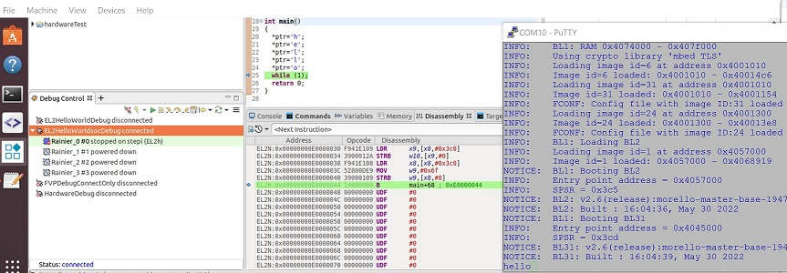

# FVP/Hardware: Create a TF-A "loop" payload running at EL2, and download an EL2 baremetal program via Development Studio

 [Go back to Morello Getting Started Guide.](./../../../morello-getting-started.md)

 ## Overview

 This guide assumes you wish to debug and step through baremetal code either on the FVP or Hardware using Development Studio for programs developed for the Normal World (EL2 and above) using the existing TFA /EL3 setup.

This describes how to:
* Generate a baremetal "loop" program as a TF-A (Trusted Firmware-A) payload. This is required to sit in a loop waiting for code to be loaded.
* Generate an EL2 baremetal program at EL2 and download from Development Studio.

The baremetal "loop" program will be created from the command line in the same way as the instructions given in: [FVP/Hardware: Create a TF-A baremetal payload running at EL2](./TFApayload.md).

The EL2 baremetal program will be created and built from Development Studio.


## Assumptions

* The LLVM toolchain for Morello baremetal has been downloaded. See [Getting the prebuilt Morello supported LLVM binaries for bare metal.](./../LlvmBinaries/LlvmBinaries.md) These are needed in order to compile application code for bare metal. It is recommended to download the latest version.
* The firmware binaries to boot to UEFI have been downloaded and built. See [Using cmake to generate firmware binaries for fvp or hardware (soc).](./../CmakeFirmwareBinaries/CmakeFirmwareBinaries.md)
* The Morello hardware is available. See [Turning on the Morello Hardware Platform for the first time.](./../../MorelloPlatform/SettingUpMorelloSoc.md) or the Morello FVP has been installed. See [Installing the Morello Fixed Virtual Platform.](./../../MorelloPlatform/InstallingMorelloFVP.md)
* If using the hardware, the debug connection has been tested and working. See [Morello Hardware: Verifying the embedded debug can connect to Development Studio](./../HardwareDebugConnect/HardwareDebugConnect.md)
* You have some familiarity with Development Studio. 


## Create "loop" program

First create a directory for your loop code. 'EL2loop/src'. 

See [FVP/Hardware: Create a TF-A baremetal payload running at EL2](./TFApayload.md) for more details

**C File**

Create a C file with the source code. It is assumed the file has been called `loop.c`.

```c
#include <stdio.h>

int main()
{
   while(1);
   return 0;
}
```

**Linker Script**

Create a linker script in the same path. Ensure the memory and sections start from the address 0xE0000000, as this is where the EL2 loop program will be placed and where your EL2 program will be loaded to from Development Studio. 

It is assumed the file has been called `link_scripts.ld.S`.
```
OUTPUT_FORMAT("elf64-littleaarch64")
OUTPUT_ARCH("aarch64")
ENTRY(main)

MEMORY {
  RAM (rwx): ORIGIN = 0xE0000000, LENGTH = 0xE0000000 + 0x200000
}

SECTIONS
{
  . = 0xE0000000;

  ro . : {
    */loop.o(.text)
    *(.text*)
    *(.rodata*)
  } >RAM

  .data : {
    *(.data*)
  } >RAM
}

```

**Build loop**

Create a bash script to build the code: `EL2loop/scripts/createprogbinNoCapsh`

```bash
<toolchain path>/bin/clang -target aarch64-none-elf -c ../src/loop.c -o ../progbinaries/noCapabilities/loop.o -O3
<toolchain path>/bin/ld.lld -o ../progbinaries/noCapabilities/loop -T ../src/link_scripts.ld.S ../progbinaries/noCapabilities/loop.o -s
<toolchain path>/bin/llvm-objcopy -O binary ../progbinaries/noCapabilities/loop
```

Run the script from the script directory:
```
./createprogbinNoCap.sh
```

This will generate a binary called `loop` to run as a non-secure payload on the Morello FVP or hardware platform.


**Package loop binary for fvp**

Create a bash script to package the program: 'helloworld/scripts/createfvpbinNoCap.sh`

The following commands /script needs to be run from the <morello_workspace> directory. Copy the commands into the script or run from the console.

```
#Build for FVP
make -C "bsp/arm-tf" PLAT=morello TARGET_PLATFORM=fvp clean

MBEDTLS_DIR="<morello_workspace>/bsp/deps/mbedtls" \
CROSS_COMPILE="<morello_workspace>/tools/clang/bin/llvm-" \
make -C "bsp/arm-tf" \
CC="<morello_workspace>/tools/clang/bin/clang" \
LD="<morello_workspace>/tools/clang/bin/ld.lld" \
PLAT=morello ARCH=aarch64 TARGET_PLATFORM=fvp ENABLE_MORELLO_CAP=0 \
E=0 TRUSTED_BOARD_BOOT=1 GENERATE_COT=1 ARM_ROTPK_LOCATION="devel_rsa" \
ROT_KEY="plat/arm/board/common/rotpk/arm_rotprivk_rsa.pem" \
BL33=<EL2loop>/progbinaries/noCapabilities/loop
all fip

#copy files to project
cp -a <morello_workspace>/bsp/arm-tf/build/morello/release/fip.bin <EL2loop>/fvpbinaries/noCap/fip.bin
cp -a <morello_workspace>/bsp/arm-tf/build/morello/release/bl1.bin <EL2loop>/fvpbinaries/noCap/bl1.bin
```

**Package loop binary for hardware (soc)**

Create a bash script to package the program: 'helloworld/scripts/createsocbinNoCap.sh`

The following commands /script needs to be run from the <morello_workspace> directory. Copy the commands into the script or run from the console.

```
#Build for SOC
make -C "bsp/arm-tf" PLAT=morello TARGET_PLATFORM=soc clean

MBEDTLS_DIR="<morello_workspace>/bsp/deps/mbedtls" \
CROSS_COMPILE="<morello_workspace>/tools/clang/bin/llvm-" \
make -C "bsp/arm-tf" \
CC="<morello_workspace>/tools/clang/bin/clang" \
LD="<morello_workspace>/tools/clang/bin/ld.lld" \
PLAT=morello ARCH=aarch64 TARGET_PLATFORM=soc ENABLE_MORELLO_CAP=0 \
E=0 TRUSTED_BOARD_BOOT=1 GENERATE_COT=1 ARM_ROTPK_LOCATION="devel_rsa" \
ROT_KEY="plat/arm/board/common/rotpk/arm_rotprivk_rsa.pem" \
BL33=<EL2loop>/progbinaries/noCapabilities/loop
all fip

#copy files to project
cp -a <morello_workspace>/bsp/arm-tf/build/morello/release/fip.bin <EL2loop>/socbinaries/noCap/fip.bin
```

## Create EL2 baremetal program in Development Studio

Open Development Studio and create a new project. Here, the example project is called **EL2HelloWorld**.

**C File**

Create a C file with the source code. You may wish to follow the example code to output 'hello' to the AP console: https://git.morello-project.org/morello/docs/-/blob/morello/release-1.3/standalone-baremetal-readme.rst , section **1. Create standalone application code**

**Boot file**

Create a basic boot file to set up the stack and registers for your EL2 program. This could be called `setupel2.S`. For a more complex set up requirement, the default initialisation script can be modified for EL2.see [How to modify the default initialisation files for your project at EL3](./../Modifycrt0/Modifycrt0.md). 

```
.align 16
.global _startel2
.type _startel2, @function
startel2:
//set up stack
ADRP x0, _stack_el2n_limit 
AND x0, x0, ~15 
MOV sp, x0
// disable trapping of floating point and morello instructions
MRS x0, CPTR_EL2
MOV x2, #0xF9FF
MOVK x2, #0xFFFF,LSL #16
AND x0, x0, x2
MSR CPTR_EL2, x0
ISB
//jump to main program
.global main
B main  
```

**Linker Script**

Create a linker script. The format of the linker script in Development Studio is slightly different to the 'loop' linker script on the command line. Include the stack.

Also ensure the boot text is the first thing that runs on entry to EL2 by including it first.

```
OUTPUT_FORMAT("elf64-littleaarch64")
OUTPUT_ARCH("aarch64")
ENTRY(main)

MEMORY {
  RAM (rwx): ORIGIN = 0xE0000000, LENGTH = 0xE0000000 + 0x200000
}

STACK_SIZE = 0x20000;

SECTIONS
{
  . = 0xE0000000;

  ro . : {
    */src/setupel2.o(.text)
    */src/EL2HelloWorld.o(.text)
    *(.text*)
    *(.rodata*)
  } >RAM

  .data : {
    *(.data*)
  } >RAM

__bss_start__ = ALIGN(8);
.bss :
{
   *(.bss*)
}>RAM
__bss_end__ = ALIGN(8);

. = ALIGN(16);
.stack_el2n (NOLOAD):
{
   _stack_el2n_start = .;
   . = . + STACK_SIZE;
   __stack_el2n_end = .;
}>RAM
end = .;
}
```

**Set the project properties**

Include the linker script in the build. Go to **File -> Properties -> C/C++Build -> Settings LLVM C Linker 11.0.0-> Miscellaneous -> +** (add -Xlinker option) `-T/<projectpath>/link_scripts.ld.S -v`

Set the entry function to the boot file. Go to **File -> Properties -> C/C++Build -> Settings LLVM C Linker 11.0.0-> Miscellaneous -> +** (add -Xlinker option) `--entry=_startel2`.

Prevent the default EL3 initialisation script from being included in the build. Go to **File -> Properties -> C/C++Build -> Settings LLVM C Linker 11.0.0-> Miscellaneous -> 'Other Flags'** Add `-nostartfiles`.

Leave the default target as: `aarch64-none-elf`. Go to **File -> Properties -> C/C++Build -> Settings ->LLVM C Compiler/LLVM Assembler / LLVM C Linker -> Target**.

**Build the project**

Build the project. **Right-click** on the project and select **Build Project**.

It is now ready to download to either FVP or Hardware.


## Download EL2 baremetal program from Development Studio to FVP

**Run the 'loop' program directly with the FVP**

You may wish to create a bash script to run the fvp: 'EL2loop/scripts/runfvpNoCap.sh`

```
<modelpath>/FVP_Morello/models/Linux64_GCC-6.4/FVP_Morello \
--data Morello_Top.css.scp.armcortexm7ct=<morello_workspace>/output/fvp/firmware/scp_romfw.bin@0x0 \
--data Morello_Top.css.mcp.armcortexm7ct=<morello_workspace>/output/fvp/firmware/mcp_romfw.bin@0x0 \
-C Morello_Top.soc.scp_qspi_loader.fname=<morello_workspace>/output/fvp/firmware/scp_fw.bin \
-C Morello_Top.soc.mcp_qspi_loader.fname=<morello_workspace>/output/fvp/firmware/mcp_fw.bin \
-C css.scp.armcortexm7ct.INITVTOR=0x0 \
-C css.mcp.armcortexm7ct.INITVTOR=0x0 \
-C css.trustedBootROMloader.fname=<EL2loop>/fvpbinaries/NoCap/bl1.bin \
-C board.ap_qspi_loader.fname=<EL2loop>/fvpbinaries/NoCap/fip.bin \
-C css.pl011_uart_ap.out_file=uart0.log \
-C css.scp.pl011_uart_scp.out_file=scp.log \
-C css.mcp.pl011_uart0_mcp.out_file=mcp.log \
-C css.pl011_uart_ap.unbuffered_output=1
--run --cadi-server
```
**Download the EL2 baremetal program to the FVP**

In Development Studio create a new connection to the FVP **File -> New -> Model Connection** and associate with the EL2 baremetal program. Once set up select **Debug**.

Run the program. You should see the message `hello` appear in the AP console if you have followed the example code.

## Download EL2 baremetal program from Development Studio to Hardware

**Run the 'loop' program on the Hardware**

1. Connect the USB cable from the Morello machine to the host computer, and turn on the Morello machine via the switch on the back. If this is the first time the Morello hardware has been turned on follow this first: [Turning on the Morello Hardware Platform for the first time.](./../../MorelloPlatform/SettingUpMorelloSoc.md)

2. If you have a **Windows** machine running a Ubuntu VM with the firmware build, open a **PuTTY** window for each COM port from Windows. The COM ports appear in the following order: **Motherboard Configuration Controller(MCC), Platform Controller Chip(PCC), Application Processor(AP), System Control Processor(SCP)**. See [Turning on the Morello Hardware Platform for the first time.](./../../MorelloPlatform/SettingUpMorelloSoc.md) on how to set up PuTTY. Alternatively you can set up a connection with something like Minicom from Ubuntu.

3. On the **Windows** machine the SD card containing the current Morello firmware files will be automatically opened, or you can browse to it. 

Under the `SOFTWARE` directory you should see the following files:

* fip.bin
* mcp_fw.bin
* scp_fw.bin

4. Replace the `fip.bin` file with your newly built version containing the loop program.

5. From the MCC console reboot the Morello machine

```
Cmd>REBOOT
```

**Download the EL2 baremetal program to the Hardware**

1. Patch the USB cable to the VM by selecting **Devices -> USB -> Arm Ltd Arm Morello USB Debug[0100]** from the VM file menu. 

2. From Development Studio create a new hardware connection. **File -> New -> Hardware Connection** and associate with the EL2 baremetal program. Select **Morello SDP** which is the only available option and click **Finish**. Wait for the **Debug Configuration** pane to open.
3. On the **Debugger** tab select **debug from entry point**.
4. Select the **CMSIS-DAP** as the Target Connection.
5. Click onto the **Browse...** button of the Bare Metal Debug Connection to open the **Connection Browser** and select the only available debug connection.
6. Click on **Files** tab and browse to the application to download.
7. Start the **Debug**.
8. Run the program. if it is working you should see something like that shown below.

