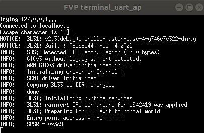

# EL2N_s_loop - Loading an assembly program at EL2

 [Go back to Morello Getting Started Guide.](./../../../../morello-getting-started.md)

## Overview and EL2 Boot flow

This example follows on from [EL3_s_loop - Loading an assembly program at EL3](./../EL3_s_loop/EL3_s_loop.md). For loading programs at EL2 however, the boot flow does not contain a modified SCP to stop the boot at EL3. Instead, the boot flow is interrupted at EL2 using a modified version of the Morello Android run script, where the UEFI boot code at 0x14200000 (not 0x14000000 as previously) is replaced with an image built for the EL2 normal world. At this point in the boot flow, the trusted firmware has also been loaded. You will need the following Android-Morello firmware files: 

* scp_romfw.bin
* mcp_romfw.bin
* scp_fw.bin
* mcp_fw.bin


## Loading the image file

Details regarding the creation of the image file was detailed in [EL3_s_loop](./../EL3_s_loop/EL3_s_loop.md). The difference in this set up is that the 2nd level boot loader (BL2), copies the whole image at 0x14200000 to DRAM at 0xE0000000, meaning that the loader function is now copied and then executed at 0xE0000000 where it then copies the program to the location at 0x8001024C in the lower half of the DRAM0 memory. The diagram shows the process.


## Creating an assembly program for EL2 without any EL3 initialisation code

Follow the steps to create and run a small piece of assembly code at EL2 without any initialisation code.

**Step 1 - Obtain files**

Either create a new directory and use the same `testloop.s` file from [EL3_s_loop](./../EL3_s_loop/EL3_s_loop.md), or use the example code in the `commandLine/bootflow/EL2N_s_loop` directory.

**Step 2 - Generate a new linker for the image script**

Generate a new linker script for the image generation script. The Morello Android loads the UEFI boot code (At EL2) from address 0x14200000, (not 0x14000000 as previous example for EL3). Create `start_el2.ld` in the `llvm-morello-releases/loader` directory to start the .text section at 0x14200000.

```
ENTRY(__init)

SECTIONS
{
    .text 0x14200000: { *(.text*) }
    .rodata : { *(.rodata*) }
    .data : { *(.data*) }
}
```

**Step 2 - Generate a new image generation script**

Copy the image generation script and call it `make-bm-image_el2.sh`. Edit the script to use the new linker script `start_el2.ld` by modifying two lines:

```
for F in start_el2.ld  init.o loader.o; do
$LOADER_TMP/start_el2.ld
```

**Step 3 - create object and elf files**

For the remaining steps a script called make_el2.sh is provided, but you must ensure the paths are correct which will depend upon where you have installed the various different repositories. Ensure you are in the `commandLine/bootflow/EL2_s_loop` directory and run the script 

```
./make_el2.sh
```

The following describes the steps to follow, or the steps that the script carries out.

Create an object file and elf file of the test program using clang.

```
~/projects/baremetalsources/llvm-morello-releases/bin/clang --target=aarch64-none-elf -c -o "output/testloop.o" "testloop.s"
~/projects/baremetalsources/llvm-morello-releases/bin/clang --target=aarch64-none-elf -march=morello -Xlinker --entry=main -o "output/testloop.elf"  ./output/testloop.o
```

**Step 4 - Create image file**

Create the image file using the new image script `make-bm-image_el2.sh`.

```
~/projects/baremetalsources/llvm-morello-releases/make-bm-image_el2.sh -i output/testloop.elf -o output/testloop_image_el2
```

**Step 4 - Run the FVP model**

Run the FVP with the loaded image. Note that this is a modified version of the Morello Android run script. The UEFI boot code is replaced with the image built here, and the Android image file is not included. The trusted firmware is running. To see the program running in **Development Studio** you need to include the `--cadi-server` option. Once the model is running, connect to the model from Development Studio using a debug connection with **Connect only** selected and then run (see the section **Creating a Connect Only Debug Connection** under [EL3_s_loop](./../EL3_s_loop/EL3_s_loop.md)). To run the boot flow and program straight away before loading Development Studio, include the `--run` option. You can run the model without Development Studio but you will not see any output and will not be able to check the memory. 

Note the following part of the script is where the image is loaded.

`--data=/home/osboxes/projects/morello-baremetal-examples/commandLine/bootflow/EL2N_s_loop/output/testloop_image_el2@0x14200000` 


```
~/projects/morello_workspace/model/FVP_Morello/models/Linux64_GCC-6.4/FVP_Morello --data Morello_Top.css.scp.armcortexm7ct=/home/osboxes/projects/morello_workspace/bsp/build-poky/tmp-poky/deploy/images/morello-fvp/scp_romfw.bin@0x0 --data Morello_Top.css.mcp.armcortexm7ct=/home/osboxes/projects/morello_workspace/bsp/build-poky/tmp-poky/deploy/images/morello-fvp/mcp_romfw.bin@0x0 -C Morello_Top.soc.scp_qspi_loader.fname=/home/osboxes/projects/morello_workspace/bsp/build-poky/tmp-poky/deploy/images/morello-fvp/scp_fw.bin -C Morello_Top.soc.mcp_qspi_loader.fname=/home/osboxes/projects/morello_workspace/bsp/build-poky/tmp-poky/deploy/images/morello-fvp/mcp_fw.bin -C css.scp.armcortexm7ct.INITVTOR=0x0 -C css.mcp.armcortexm7ct.INITVTOR=0x0 --data=/home/osboxes/projects/morello-baremetal-examples/commandLine/bootflow/EL2N_s_loop/output/testloop_image_el2@0x14200000 -C css.pl011_uart_ap.out_file=/home/osboxes/projects/morello_workspace/run-scripts/uart0-bootflow.log -C css.scp.pl011_uart_scp.out_file=/home/osboxes/projects/morello_workspace/run-scripts/scp-bootflow.log -C css.mcp.pl011_uart0_mcp.out_file=/home/osboxes/projects/morello_workspace/run-scripts/mcp-bootflow.log -C css.pl011_uart_ap.unbuffered_output=1 -C displayController=0 -C board.virtio_rng.enabled=1 -C board.virtio_rng.seed=0 -C num_clusters=2 -C num_cores=2 -C board.hostbridge.userNetworking=true -C board.smsc_91c111.enabled=true -C board.hostbridge.userNetPorts="5555=5555" --run --cadi-server
```

## Checking the Morello Memory

From **Development Studio** open the **Disassembly Window** at 0x14200000. If everything is working you should be able to see the code sections in the BOOT memory region.

**.text section**

**__init start address**

```
EL2N:0x0000000014200000 : ADRP     x0,#0x1000				
```

**memcpy start address**

```
EL2N:0x0000000014200014 : CBZ      x2,#0x18				
```

**memset start address**

```
EL2N:0x0000000014200030 : CBZ      x2,#0x14				

```

**load_elf start address**

```
EL2N:0x0000000014200048 : STP      x29,x30,[sp,#-0x40]!
```

**.rodata section**

**init/fini start address**

```
EL3:0x00000000142002B4 : STP      c29,c30,[sp,#-0x20]!
```

**program**

```
EL3:0x000000001420032C : MOV      x0,#0x43				
EL3:0x0000000014200330 : NOP
EL3:0x0000000014200334 : NOP
EL3:0x0000000014200338 : B        {pc}-12 ; 0x1420032C
EL3:0x000000001420033C : RET
```

**exit code start address**

```
EL3:0x0000000014000340 : MOV      x1,x0
```

From **Development Studio** open the **Disassembly Window** at 0xE000000. If everything is working you should be able to see a complete copy of the code that is in the BOOT memory region. 

**.text section**

**__init start address**

```
EL2N:0x00000000E0000000 : ADRP     x0,#0x1000				
```

**memcpy start address**

```
EL2N:0x00000000E0000014 : CBZ      x2,#0x18				
```

**memset start address**

```
EL2N:0x00000000E0000030 : CBZ      x2,#0x14			
```

**load_elf start address**

```
EL2N:0x00000000E0000048 : STP      x29,x30,[sp,#-0x40]!
```

**.rodata section**

**init/fini start address**

```
EL2N:0x00000000E00002B4 : STP      c29,c30,[sp,#-0x20]!
```

**Program**

```
EL2N:0x00000000E000032C : MOV      x0,#0x43			
EL2N:0x00000000E0000330 : NOP
EL2N:0x00000000E0000334 : NOP
EL2N:0x00000000E0000338 : B        {pc}-12 ; 0xE000032C
EL2N:0x00000000E000033C : RET
```

**exit code start address**

```
EL2N:0x00000000E0000340 : MOV      x1,x0
```


From **Development Studio** open the **Disassembly Window** at 0x8000000. If everything is working you should be able to see a copy of the program in memory at 0x8001024C, along with the init/fini and exit code. You should be able to step through the instructions and see the program looping around.

**init/fini start address**

```
EL2N:0x00000000800101D4 : STP      c29,c30,[sp,#-0x20]!
```

**Program**

```
EL2N:0x000000008001024C : MOV      x0,#0x43			
EL2N:0x0000000080010250 : NOP
EL2N:0x0000000080010254 : NOP
EL2N:0x0000000080010258 : B        {pc}-12 ; 0x8001024C
EL2N:0x000000008001025C : RET
```

**exit code start address**

```
EL2N:0x0000000080010260 : MOV      x1,x0
```


## UART displays

Whilst running a number of uart outputs display messages.

The uart_ap window will display as follows. Notice that BL33 (the image file) has been copied to DDR memory, and the normal world entry point address is 0xe0000000.




The uart_aon window will display as follows. Notice that the AP reset address is 0x04040000, and that BL31 (trusted firmware-A) has been copied to this address.


The uart0 window will display as follows:


