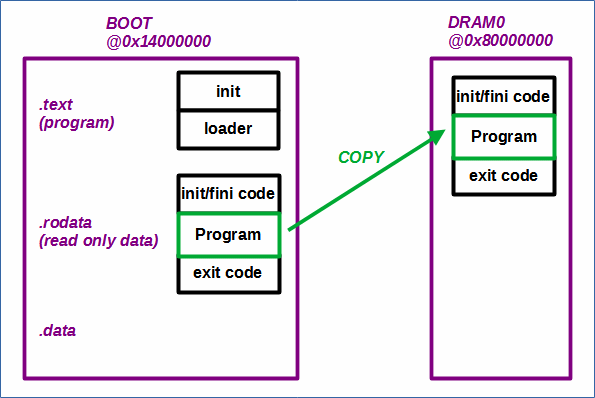

# EL3_s_loop - Loading an assembly program at EL3

 [Go back to Morello Getting Started Guide.](./../../../../morello-getting-started.md)

 ## Overview

 This example shows how to load a small assembly program at EL3. It is very similar to the ["hello world" on the command line](./../../BareMetalOnMorello/HelloWorldCommandLine/HelloWorldCommandLine.md) example, but with some modifications to by-pass the EL3 Morello initialisation code (see [Initialisation sequence for Morello](./../../BareMetalOnMorello/DefaultSetup/InitSequence/InitSequence.md)). The reason for including an example without the EL3 initialisation code is in preparation for compiling boot flow code for other exception levels such as the normal world in EL2N. Since EL2 can not access EL3 registers, the initialisation code, which is included by default by the bare metal version of the LLVM compiler (which accesses EL3 registers), needs to be by-passed at compilation. 


 ## EL3 Boot flow

During the trusted bootflow process the 1st level boot loader (BL1) loads the 2nd level boot loader (BL2). These boot processes consist of the SCP/MCP firmware. BL2 then loads all of the 3rd level images. When the SCP reset address modification is in place to run bare metal code ([see Bare metal build options](./../../BareMetalOnMorello/BuildOptions/BuildOptions.md)), none of the trusted boot 3rd level images are loaded. Instead, an alternative bare metal program can be loaded at EL3 which initially resides in memory at the reset address 0x14000000. 

However, in order to understand how this bare metal program is subsequently loaded and run, it is necessary to understand how the image file is generated and how it operates.

## Understanding the image file 

The ["hello world" on the command line](./../../BareMetalOnMorello/HelloWorldCommandLine/HelloWorldCommandLine.md) example loaded the howdy image for Morello directly into the FVP at the AP reset address of 0x14000000. There were two stages of compilation in this example. The first stage was to generate an elf file from the c program, and the second stage was to generate an image file from the elf file. It is now necessary to take a more detailed look at what the image script `make-bm-image.sh` does. The image script generates or uses the following files:

* embed.s - this is generated by the `make-bm-image.sh` script, and embeds the program elf file into the rodata section (read only data section).
* init.o - __intit function, sets up the stack and branches to the loader
* loader.o - contains three functions: load_elf, memcpy, memset. Loads the program elf file into DRAM0 memory.
* start.ld - linker script to start the sections at 0x14000000, with an entry point of __init

The script takes the program elf file and combines it with a loader function. The program elf file becomes embeded into the read only data section so that it is treated as data, rather than a program, as shown in the diagram. The loader function now becomes the main program running at 0x14000000. The purpose of the loader is to load the program from the read only data section from within the 0x14000000 memory region to the DRAM0 memory region starting at 0x80000000 so the program can be run. The script produces a binary image of the combined program.



## Creating an assembly program for EL3 without any EL3 initialisation code

Follow the steps to create and run a small piece of assembly code at EL3 without any Morello initialisation code.

**Step 1 - create a new directory**

Either create a new directory or use the example code in `commandLine/bootflow/EL3_s_loop` directory.

**Step 2 - create assembly code**

Either create or use the small assembly code provided called testloop.s to sit in a loop. You must name the function `Main` since clang is expecting to compile and link at least a `main` function. You do not need a linker script or a c file. The LLVM binaries will automatically place the program in DRAM0 memory region.

```
  .global main
  .type main, @function
main:

// do some random stuff and sit in a loop
  LOOP:
  MOV      x0, #0x43
  NOP
  NOP
  B LOOP
  RET

```

**Step 3 - create object file**

For the remaining steps a script called make_el3.sh is provided, but you must ensure the paths are correct which will depend upon where you have installed the various different repositories. Ensure you are in the `commandLine/bootflow/EL3_s_loop` directory and run the script 

```
./make_el3.sh
```

The following describes the steps to follow, or the steps that the script carries out.

Create an object file of the test program using clang.

```
~/projects/baremetalsources/llvm-morello-releases/bin/clang --target=aarch64-none-elf -c -o "output/testloop.o" "testloop.s"
```

**Step 4 - Create elf file**

Create an elf file from the object file with minimal initialisation. You must ensure the image entry point is pointing to the `main` function using the `-Xlinker --entry=main` option. This will bypass the _start Morello initialisation code thats sets up specific EL3 registers (see the [Initialisation sequence for Morello](./../../BareMetalOnMorello/DefaultSetup/InitSequence/InitSequence.md) for more information).

```
~/projects/baremetalsources/llvm-morello-releases/bin/clang --target=aarch64-none-elf -march=morello -Xlinker --entry=main -o "output/testloop.elf"  ./output/testloop.o
```

**Step 5 - Create image file**

Create the image file using the image script `make-bm-image.sh`.

```
~/projects/baremetalsources/llvm-morello-releases/make-bm-image.sh -i output/testloop.elf -o output/testloop_image_el3
```

**Step 6 - Run the FVP model**

Run the FVP with the loaded image. To see the program running in [**Development Studio**](./../../BareMetalOnMorello/InstallingArmDevStudio/InstallingArmDevStudio.md) you need to include the `--cadi-server` option. Once the model is running, connect to the model from Development Studio using a debug connection with **Connect only** selected and then run (see the section **Creating a Connect Only Debug Connection** below for a detailed description of how to do this). You can run the model without Development Studio but you will not see any output and will not be able to check the memory.

Note the following part of the script is where the image is loaded.

`--data=/home/osboxes/projects/morello-baremetal-examples/commandLine/bootflow/EL3_s_loop/output/testloop_image_el3@0x14000000` 

```
~/projects/morello_workspace/model/FVP_Morello/models/Linux64_GCC-6.4/FVP_Morello --data Morello_Top.css.scp.armcortexm7ct=/home/osboxes/projects/baremetalsources/bare-metal-example-scpmcp-binaries/SCPMCPBuiltWithAPreset0x14000000/scp_romfw.bin@0x0 --data Morello_Top.css.mcp.armcortexm7ct=/home/osboxes/projects/baremetalsources/bare-metal-example-scpmcp-binaries/SCPMCPBuiltWithAPreset0x14000000/mcp_romfw.bin@0x0 -C Morello_Top.soc.scp_qspi_loader.fname=/home/osboxes/projects/baremetalsources/bare-metal-example-scpmcp-binaries/SCPMCPBuiltWithAPreset0x14000000/scp_fw.bin -C css.scp.armcortexm7ct.INITVTOR=0x0 -C css.mcp.armcortexm7ct.INITVTOR=0x0 --data=/home/osboxes/projects/morello-baremetal-examples/commandLine/bootflow/EL3_s_loop/output/testloop_image_el3@0x14000000 -C css.cluster0.cpu0.semihosting-heap_base=0xB0000000 -C css.cluster0.cpu0.semihosting-heap_limit=0xBE000000 -C css.cluster0.cpu0.semihosting-stack_limit=0xBE000000 -C css.cluster0.cpu0.semihosting-stack_base=0xBFFC0000 --cadi-server
```

## Checking the Morello Memory

From **Development Studio** open the **Disassembly Window** at 0x14000000. If everything is working you should be able to see the following code sections in the BOOT memory region.

**.text section**

**__init start address**

```
EL3:0x0000000014000000 : ADRP     x0,#0x1000				
```

**memcpy start address**

```
EL3:0x0000000014000014 : CBZ      x2,#0x18				
```

**memset start address**

```
EL3:0x0000000014000030 : CBZ      x2,#0x14				

```

**load_elf start address**

```
EL3:0x0000000014000048 : STP      x29,x30,[sp,#-0x40]!
```

**.rodata section**

**init/fini start address**

```
EL3:0x00000000140002B4 : STP      c29,c30,[sp,#-0x20]!
```

**program**

```
EL3:0x000000001400032C : MOV      x0,#0x43				
EL3:0x0000000014000330 : NOP
EL3:0x0000000014000334 : NOP
EL3:0x0000000014000338 : B        {pc}-12 ; 0x1400032C
EL3:0x000000001400033C : RET
```

**exit code start address**

```
EL3:0x0000000014000340 : MOV      x1,x0
```

From **Development Studio** open the **Disassembly Window** at 0x80000000. If everything is working you should be able to see that the program has been copied to DRAM0, along with the init/fini and exit code. You should be able to step through the instructions and see the program looping around.

**init/fini start address**

```
EL3:0x00000000800101D4 : STP      c29,c30,[sp,#-0x20]!
```

**program**

```
EL3:0x000000008001024C : MOV      x0,#0x43			
EL3:0x0000000080010250 : NOP
EL3:0x0000000080010254 : NOP
EL3:0x0000000080010258 : B        {pc}-12 ; 0x8001024C
EL3:0x000000008001025C : RET
```

**exit code start address**

```
EL3:0x0000000080010260 : MOV      x1,x0
```

## Creating a Connect Only Debug Connection

1. Select **File -> New -> Model Connection**
2. Give it a name such as `connectOnlyDebug`, and select **Next**. Do not associate with an existing project.
3. Select **Arm FVP -> Morello** and click **Finish**. Wait for the **Edit Configuration** dialogue box to appear.
4. Under the **Connection** tab select **Rainier Multi-Cluster SMP**.
5. Under the **Debugger** tab select **Connect only**.
6. Select **Apply** and then **Debug** if you are ready to connect to the FVP, or **Close** to save for later. It should appear under the **Project Explorer** window ready to use.