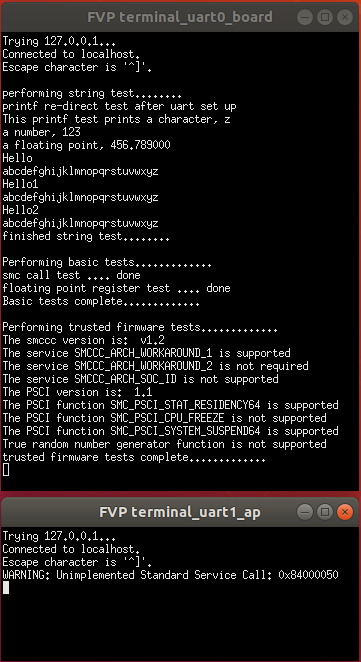

# developmentStudio/trustedFW_EL2 - Trusted Firmware Tests

 [Go back to Morello Getting Started Guide.](./../../../../morello-getting-started.md)

 ## Overview

This example uses a [small loop assembly code](./../EL2N_s_loop/EL2N_s_loop.md) that is built into an image to replace the uefi boot code at 0x14200000. At this point in the boot flow, the trusted firmware has been loaded and the exception level is at EL2 - normal world. **Development Studio** is then used to load a program to run at EL2N (See [BootFlowOverview](./../../BootFlowOverview/BootFlowOverview.md)). The program performs some basic interface tests to the trusted firmware. 

---

Part of this code has been extracted from the Trusted Firmware-A tests repository

 https://git.trustedfirmware.org/TF-A/tf-a-tests.git/ d6715f10.....

 under the following license (https://spdx.org/licenses/BSD-3-Clause.html):

 Copyright (c) 2018, Arm Limited. All rights reserved.
 
 SPDX-License-Identifier: BSD-3-Clause

 ---

This example code also uses an embedded printf function from https://github.com/mpaland/printf d3b98468..... under an **MIT license**.

---

 ## Trusted Firmware MMU setup at EL3

The MMU map shows the mapping at EL3 when the trusted firmware is loaded through the boot flow process (The EL3 MMU map was captured by performing an SMC command at EL2 and stepping through the code to give access to EL3 in the debugger). By inspecting the disassembly view, it can be seen that the trusted firmware resides in the BOOT section of the memory map, which is marked as SP - secure physical. The NP - non secure physical address is also mapped for the DRAM0 memory. Since the trusted firmware code resides in the BOOT section, the whole of the DRAM0 is available to run normal world code.

 

 ## Program Structure

 The program structure is given below. The SMC calling convention is used to interact with the trusted firmware.

  

 ## Image entry point for EL2N

This example uses the bare metal llvm compiler with a basic **morello initialisation code for EL2**, so that the **image entry point** is `_startel2`.

 The [default Morello Initialisation code](./../../../BareMetalOnMorello/DefaultSetup/InitSequence/InitSequence.md) is specifically for EL3. Only a basic initialisation code has been written here for EL2N to run this example and consists of the following:

 * Initialises the stack for EL2N.
 * Disables the trapping of the SIMD - floating point registers which are used for string manipulation.
 * Disables the trapping of Morello specific instructions  - without this the printf function doesn't work (as it compiles to use capability registers).
 * Branch to main();


 ## Example code set up

 **MMU set up:**
The MMU is set up as follows:
* EL2NMMU
    *  0x00000000 - 1GB device memory
    *  0x40000000 - 1GB device memory
    *  0x80000000 - 1GB program memory
    *  0xC0000000 - 1GB program memory

 **UART:** This example uses the pl011 uart at a base address of 0x1C090000.

 **printf:** This example uses an embedded printf function from https://github.com/mpaland/printf under an **MIT license** to enable the _putchar() function to be re-directed to the uart (It was not clear how to re-direct the default printf function since it did not call a putc/fputc function).


 ## Files

* EL2N files:
    * setupel2.S - contains the _startel2 image entry point
    * trustedFW_EL2.c - main c code main() at EL2N
    * el2mmusetup_allDRAM.s - MMU setup for EL2N
    * trustedFW_EL2asmfuncs.s - interface to trusted firmware assemblyfunctions
    * trustedFW_EL2funcs.c - interface to trusted firmware c functions
    * trustedFW_EL2funcs.h - interface to trusted firmware c functions header
    * printf.h - embedded printf header
    * printf.c - embedded printf function
    * uart_redirect.c - uart c functions
    * uart_redirect.h - uart c functions header
    * linker-script-el2.ld - linker script for el2

## SMC - Secure Monitor Calls

The test program uses secure monitor calls (SMC) calls to interface to the Trusted Firmware-A. For more information on SMC calls see [EL1ToEL3SMC](./../../../BareMetalOnMorello/BareMetalExamples/EL1ToEL3SMC/EL1ToEL3SMC.md), or https://developer.arm.com/architectures/system-architectures/software-standards/smccc. 

The SMC instruction is used together with a set of input arguments including a **function identifier**, to uniquely identify a specific function. Types of functions (a.k.a. services) are grouped into ranges of identifying numbers as follows:

---

* 0x00000000-0x0100FFFF - Reserved for existing APIs
* 0x02000000-0x1FFFFFFF - Trusted OS Yielding Calls
* 0x20000000-0x7FFFFFFF - future expansion of Trusted OS Yielding Calls
* 0x80000000-0x8000FFFF SMC32 / 0xC0000000-0xC000FFFF SMC64 - **Arm Architecture Calls**
* 0x81000000-0x8100FFFF SMC32 / 0xC1000000-0xC100FFFF SMC64 - CPU Service Calls 
* 0x82000000-0x8200FFFF SMC32 / 0xC2000000-0xC200FFFF SMC64 - SiP Service Calls
* 0x83000000-0x8300FFFF SMC32 / 0xC3000000-0xC300FFFF SMC64 - OEM Servuce Calls
* 0x84000000-0x8400FFFF SMC32 / 0xC4000000-0xC400FFFF SMC64 - **Standard Service Calls**
* 0x85000000-0x8500FFFF SMC32 / 0xC5000000-0xC500FFFF SMC64 - Standard Hypervisor Service Calls
* 0x86000000-0x8600FFFF SMC32 / 0xC6000000-0xC600FFFF SMC64 - Vendor Specific Hypervisor Calls
* 0x87000000-0xAF00FFFF SMC32 / 0xC7000000-0xEF00FFFF SMC64 - Reserved for future expansion
* 0xB0000000-0xB100FFFF SMC32 / 0xF0000000-0xF100FFFF SMC64 - Trusted Application Calls
* 0xB2000000-0xBF00FFFF SMC32 / 0xF2000000-0xFF00FFFF SMC64 - Trusted OS Calls


---

Only a very small number of tests have been included within this example (functions within those highlighted above) to minimise the complexity and demonstrate the basic principle of calling into functions within the trusted firmware.

The SMC calling convention is documented here https://developer.arm.com/documentation/den0028/b/ from which the following **Arm Architecture Calls** are tested to see if they are present.

* SMCCC_VERSION - Retrieve the implemented version of the SMC Calling Convention
* SMCCC_ARCH_FEATURES - Determine the availability and capability of Arm Architecture Service functions
* SMCCC_ARCH_SOC_ID - service function discovery of - "Obtain a SiP defined SoC identification value"
* SMCCC_ARCH_WORKAROUND_1 - service function discovery of "Execute the mitigation for CVE-2017-5715 on the calling PE"
* SMCCC_ARCH_WORKAROUND_2 - service function discovery of "Enable or disable the mitigation for CVE-2018-3639 on the calling PE"

The **PSCI functions** are part of the **Standard Service Calls** and their function IDs are documented here https://developer.arm.com/documentation/den0022/latest. The PSCI version is retrieved, along with a test to see if a number of optional functions exist. 

* PSCI_VERSION - retrieve the PSCI version implemented
* SMC_PSCI_STAT_RESIDENCY64 - optional, statistics for power states
* SMC_PSCI_CPU_FREEZE - optional, places a core in a low power state
* SMC_PSCI_SYSTEM_SUSPEND64 - optional, places a core in  the deepest low-power state

The **true random number generator (TRNG)** is also part of the **Standard Service Calls**. The test program checks to see if the function is present, and if it is, retrieves some random numbers and displays them on the uart.

* SMC_TRNG_VERSION - retrieve the TRNG version implemented
* SMC_TRNG_RND - retrieve a random number


## Build the Project
Build the project within Development Studio. First check the linker is pointing to the linker script correctly. Select the project, and right click, then **Properties -> C/C++ Build -> settings -> LLVM C Linker 11.0.0 -> Miscellaneous**.

```
-T/<directory name>/morello-baremetal-examples/developmentStudio/<project name>/src/linker-script.ld -v
```
Then build the project. **Project -> Build Project**

## Connect to the FVP Model
Launch the FVP model by running the automated script to build and include the [small loop assembly code](./../EL2N_s_loop/EL2N_s_loop.md) for EL2N in place of the uefi boot code at 0x14200000. The program will sit in a loop at EL2N waiting for the debugger to load the trusted firmware test program. To ensure that the boot flow and small loop code runs prior to downloading the test program from Development Studio, include the `--run` option in the fvp command line of the script as detailed in the [small loop assembly code](./../EL2N_s_loop/EL2N_s_loop.md). Navigate to `commandLine/bootflow/EL2N_s_loop` directory and run the script:


```
./make_el2.sh
```


 Double click `<Project>Debug.Launch` and then select `Debug`. The Debugger should connect to the target. 

## Run the Code
In the **Debug Control** window, Either run or step through the code. If it is working correctly you should see the test results appear on a uart terminal window. Uart0 is the output from the program. Uart1 is the output from the firmware. The firmware indicates that the standard service call 0x84000050 (SMC_TRNG_VERSION) is not implemented which is the true random number generator function, and matches up with the test response from the program.

 


To stop the software and FVP, firstly disconnect the target from within Development Studio, and then type `CTRL+C` in the console from which the FVP was launched.

