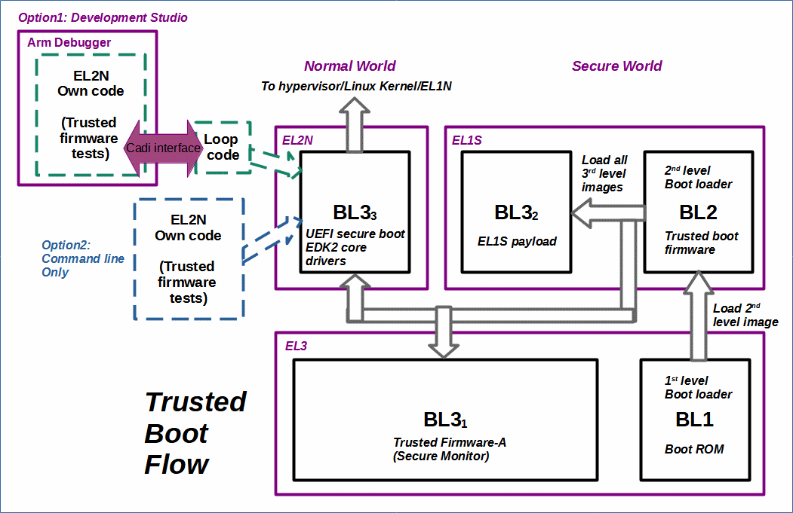

# Trusted Boot Flow

 [Go back to Morello Getting Started Guide.](./../../../morello-getting-started.md)

 ## Boot flow to run bare metal programs at EL2

 In the trusted boot flow process, the first level boot loader (BL1) resides in the boot ROM and loads the second level boot loader (BL2). The second level boot loader loads all of the level 3 images (BL3). For the bare metal examples at EL3, the boot flow process is stopped at EL3 by changing the AP reset address within the SCP firmware. To run bare metal code at EL2N the boot flow process is allowed to continue, and then the BL33 image is replaced with either of the following options:

 * Option 1: a loop code to allow **Development Studio** to download and debug a stand-a-lone EL2N bare metal program.

 * Option 2: a stand-a-lone EL2N bare metal program to directly replace the UEFI boot.

  

  ## Compiling with LLVM bare metal for EL2N

  At the time of writing, it was not possible to use the default setup of the LLVM bare metal compiler to compile programs directly for EL2N. The examples for EL2N refered to in this repository either by-pass the _start function containing the morello initialisation code for EL3, or use one created by the author and supplied with the examples. 