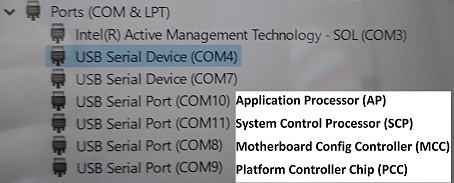
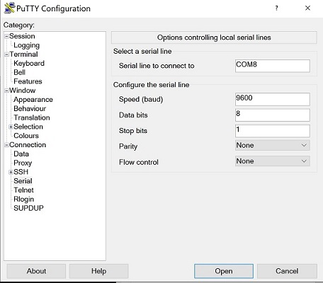
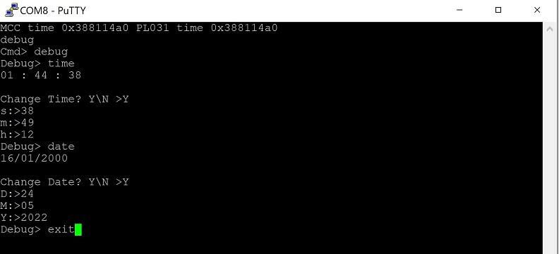
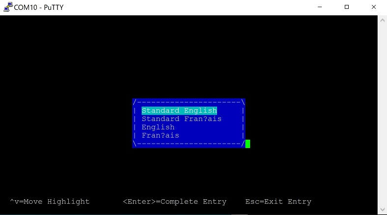

# Turning on the Morello Hardware Platform for the first time.
 [Go back to Morello Getting Started Guide.](./../../morello-getting-started.md)

The *Morello Platform* is a prototype development board with Arm cores supporting *Cheri capabilities*.

This document describes what to do when turning on the Morello hardware platform for the **first time** when connected to a host **Windows** machine. 

It is assumed the host Windows machine is able to boot Ubuntu, e,g via a VM to build the necessary firmware and software binaries and run debug software ([Morello edition of Development Studio](./../BareMetalOnMorello/InstallingArmDevStudio/InstallingArmDevStudio.md)) if necessary for bare metal development. But this is not covered in this document.

This document does not include details of how to install a CHERI software stack, or new firmware binaries.

## Further information:

Further information regarding set up (including installing a CHERI software stack) can be found here:

https://git.morello-project.org/morello/docs/-/blob/morello/release-1.3/user-guide.rst#id30

https://developer.arm.com/documentation/den0132/0100/Setting-up-the-Morello-Hardware-Development-Platform 


## On first boot up: one time setting of time/date

1. Turn on the host computer. From Windows open **Device Manager** (Start -> Control Panel -> Device Manager) and open up the section on **Ports (COM & LPT)**. Observe existing COM ports (new ones will be added when the Morello machine is connected).
2. Connect the supplied USB cable from the Morello machine to the host computer.
3. Connect the supplied power cable to the Morello machine.
4. Turn on the Morello machine via the switch on the back.
5. Observe the new COM ports. They will be in the following order: **Motherboard Configuration Controller(MCC), Platform Controller Chip(PCC), Application Processor(AP), System Control Processor(SCP)**




6. Open a **PuTTY** window for each COM port and select **Serial** Connection. set up a link with the following settings:

	* 115200 baud
	* 8-bit word length
	* No parity
	* 1 stop bit
	* No flow control


	

7. Wait for the MCC console window to output the date. Press return to get the `Cmd>` prompt. Enter the following commands to set the time and date. Enter seconds (s), minutes (m), hours (h) for the time, and day (D), month (M), year (Y) for the date.
```
Cmd>debug
debug>time
debug>date
debug>exit
```


8. Now that the time and date is set reboot the machine by typing the following into the MCC console window.
```
Cmd>REBOOT
```
9. Wait for the machine to boot and observe all the console windows. This time the AP console should show the UEFI boot screen.



10. To shutdown type the following into the MCC console. Then turn off the machine.
```
Cmd>SHUTDOWN
```

The Morello machine can now be set up with a CHERI software stack if required, be installed with newer versions of the firmware binaries, or is ready for bare metal development. See [Morello Hardware: Verifying the embedded debug can connect to Development Studio](./../BareMetalOnMorello/HardwareDebugConnect/HardwareDebugConnect.md) for bare metal development.